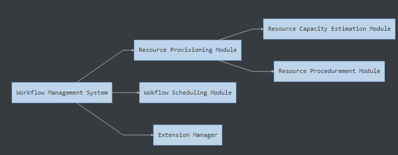
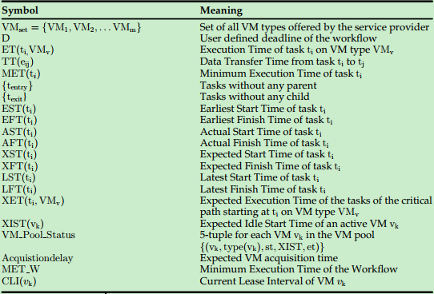

## Benefits and Issues of Cloud

### Benefits

* Infinite economical resources
* Direct on-demand provisioning
* Elasticity

### Issues

* Performance variation
* Instance acquisition and terminal delay
* Heterogeneous IaaS resources

## Basic Assumptions

* Be in the same data center or region, so the bandwidth is roughly equal.

* Different types of VMs, and no limitation on the number of VM.

* When an VM leased, requires an initial boot time for initialization. When released, requires some time for proper shutdown.

* Charged for time intervals they use a VM.

* Data transfer cost is assumed to zero because of internal data transfer is free for most cloud environments

* VM type($VM_v$) is defined by $\{(ET_{t_i})_v,C_v\}$, specifies its estimated processing time for each task $t_i$ and cost per time interval.

* Data transfer time TT($e_{ij}$) is $\frac{dt_i}{\beta}$, where  $dt_i$ is the size of the output data file to be transfered from $t_i$ to $t_j$, and $\beta$ is the average bandwidth within the cloud datacenter

* **Objective**: minimize the total  execution cost while meeting the user defined deadline constraints
  $$
  Minimize~C = \sum^{|VMpool|}_{k=1}C_{type(v_k)} * [(\frac{et_k- st_k}{time~interval})]\\
  subject~to~TET \leq D where, TET = \max_{t_i}\{(AFT(t_i\}
  $$

## Symbols and Meanings

* $$MET(t_1) = \min_{VM_v\in VM_{set}}\{ET(t_i, VM_v)\}$$
* $$
  \begin{equation}
  \left\{
      \begin{array}{**rc1**}
      EST(t_{entry}) &=& 0\\
      EST(t_i) &=& \max_{t_p \in t_i's~parent} \{EST(t_p)+MET(t_p)+TT(ep_i)\}
      \end{array}
  \right.
  \end{equation}
  $$

* $$EFT(t_i) = EST(t_i)+MET(t_i)$$
* $$
  XFT(t_i) = \begin{equation}
  \left\{
      \begin{array}{**rc1**}
      AST(t_i)+ET(t_i, type(v_k)), if ~t_i~ is ~ in~execution\\
      \max_{t_p \in t_i's~parent}\{XFT(t_p) +TT(e_{pi}\}+ET(t,type(v_k)),\\
      if~ t_i~is~waiting~for~execution
      \end{array}
  \right.
  \end{equation}
  $$

* $$
  \begin{equation}
  \left\{
      \begin{array}{**rc1**}
    	XST(t_{entry}) &=& acquistiondelay\\
      XST(t_i) &=& \max_{tp\in t_i's~parent}\{XFT(t_p)+TT(e_{pi}\}
      \end{array}
  \right.
  \end{equation}
  $$

* $$
  XIST(v_k) = \begin{equation}
  \left\{
      \begin{array}{**rc1**}
      AST(t_p)+ET(t_p,type(v_k)), if~t_p~is~in~execution\\
      XST(t_p)+ET(t_p,type(v_k)),if~t_p~is~waiting~for~execution
      \end{array}
  \right.
  \end{equation}
  $$

* $$
  \begin{equation}
  \left\{
      \begin{array}{**rc1**}
      LFT(t_{exit} &=& D)\\
      LFT(t_i) &=& \min_{t_c\in t_i's~children}\{LFT(t_c)-MET(t_c)-TT(e_{ic})\}
      \end{array}
  \right.
  \end{equation}
  $$

* $$LST(t_i) = LFT(t_i) - MET(t_i)$$
* $$
  \begin{equation}
  \left\{
      \begin{array}{**rc1**}
      XET(t_{exit},VM_{v}) &=& ET(t_{exit},VM_v)\\
      XET(t_i,VM_v) &=& ET(t_i,VM_v)+\max_{t_c\in t_i's~parent}\{XET(t_c,VM_v)\}
      \end{array}
  \right.
  \end{equation}
  $$

* $$MET_W = \max_{t_i\in W}(EFT(t_i))$$
* $$CLI(v_k) = [st_k,st_k+n\times time~intervals]$$

