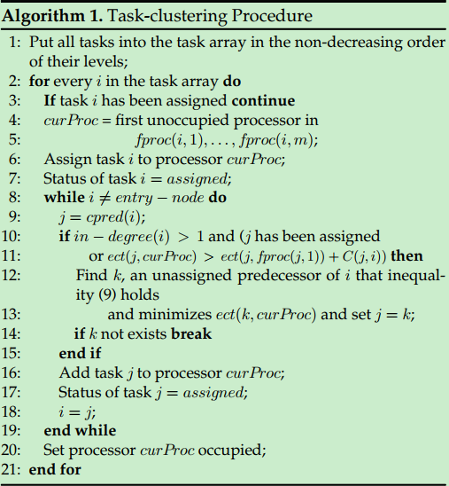
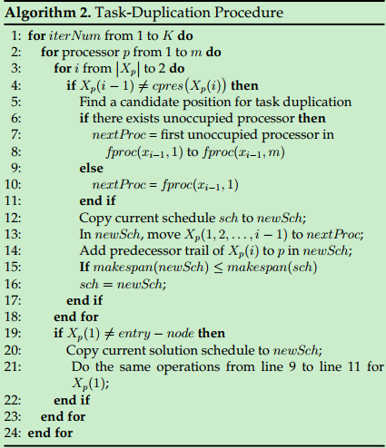

## 概述

### 基础知识

* DAG调度属于静态调度问题，现有算法可以分为三大类：

  * list scheduling:主要思想是计算出每个任务的优先级，然后按照优先级来进行处理。K.Shin定义了三种类型的任务优先级：

    (1)S-Level:按照从当前结点到最后结点的最长路径(不考虑传输代价)

    (2)B-Level:按照从当前结点到最后结点的最长路径(考虑传输代价)

    (3)T-Level:从开始结点到当前结点的最长路径(考虑传输代价)

  * cluster-based scheduling:首先进行任务聚类，然后对类分配到不同的处理器上，然后可能对类进一步合并

  * task duplication-based scheduling：思想就是可以减少传输代价，充分利用处理器空闲的时间

### 以往算法的问题及本文主要贡献

* 以往算法有以下问题：
  * (1)非常依赖一些关键的参数，比如最早完成时间，但是提前计算得到的这些参数可能并不准确，会导致得到局部最优解
  * (2)在现有的算法下，一旦task duplication是无效的就会弃用，但是实际上有可能当其他复制的task被执行之后这个任务复制又会变得有用了
* 本文贡献：(Task Duplication based Clustering Algorithm)
  * (1)New definition of **Key Parameters**:(文章中说和baseline algorithm TANH比较，比如定义est的时候，如果前后两个任务在一个处理器上，就不用考虑传输代价，会比较准确，不过这不是应该的么，这也算创新？？)
  * (2)Improving the initial clustering:现有的算法都是将一个父节点的任务进行复制，而TDCA也会考虑等待其他类中的父节点将结果传输过来
  * (3)Considering of the chain reaction：进行任务复制的时候看链式反应现象，有可能现在没用，但是过一段时间就有用了

## 问题及基本符号定义

### 符号定义

* DAG=<V,E,P,T,C>. V:任务节点的集合; n:任务的数目; E:边的集合(依赖关系); e:边的数量; P是处理器的集合，共m种; T是$n\times m$的矩阵，T(i,p)代表第i个任务在第p种处理器上进行的代价; C是$n\times n$的矩阵，代表了任务之间的传输代价(communication costs)
* PRED(i):代表i的父节点的集合; SUCC(i)代表i的子节点的集合;

## 算法简介

* 基于TANH算法进行改进的，所以先对TANH算法进行简介，然后则是本文提出的TDCA算法

### TANH算法

* Parameter calculation:

  The processor is defined as **favorite** if using that for execution of task j(j $\in$ V) results in a minimum completion time for the task j.  

  * *est(i)*:最早开始时间
  * *ect(i)*:最早完成时间
  * favorite processors: 取值范围为*fproc(i,1)*到*fproc(i,m)*
  * favorite predecessor: fpred(i)
  * *level(i)*: B-level
  * *last(i)*: latest allowable starting time
  * *lact(i)*: latest allowable completion time

* Initial Cluster Generation:首先按照*level*值进行不减的排序，而后每次选择未被安排的任务，并加入到新的cluster中，然后迭代进行如下的过程：

  每次添加i的一个父节点(一般是fproc(i)),直到每个节点都被加入到类中。整个类被安排到一个不被占用的处理器上，如果所有处理器都被占用，则将其安排到一个虚拟的处理器上，并且一个任务的执行时间定为此任务的平均运行时间

* Task duplication or clustering merging:如果存在类被安排到虚拟结点，则此步要进行cluster的合并，思想是将任务计算量大的和任务计算量小的合并在一起，从而使得被合并的类的总计算量只有少量的增长。如果没有类被安排到虚拟节点，则尝试进行任务复制，比如任务集合$\{x_1,x_2,...,x_k\}$, TANH可以把任务$x_1$到$x_{i-1}$复制到另一个处理器q，q是从$fproc(x_{i-1},1)$到$fproc(x_{i-1},m)$中第一个不被占用的处理器，而后把$fpred(x_i),fpred(fpred(x_i)),...$，依次加入

### TDCA算法

* 分为四个阶段：聚类初始化，任务复制来减少完成时间，类别的合并来得到一个初步的调度，增加阶段用于利用处理器的空闲时间。

#### 符号定义

* *Communication Cost*:
  $$
  \begin{equation}
  \delta(j,i,q,p) = \left\{
      \begin{array}{**rc1**}
    0&q=p\\
    C(j,i)& q\neq p
      \end{array}
  \right.<j,i> \in E
  \end{equation}
  $$

* *Earliest Starting Time*:
  $$
  est(i,p) = \max_{j\in PRED(i)}\{\min_{q\in P}\{ect(j,q)+\delta(j,i,q,p)\}\}
  $$

* *Earlist Completion Time*:
  $$
  ect(i,p) = est(i,p) + T(i,p)
  $$

* *The r**th** Favorite Processor*:
  $$
  ect(i,fproc(i,1))\leq ... \leq ect(i,fproc(i,r))
  $$

* *Critical Predecessor*:假设所有任务都分配给最喜欢的处理器，cpred（i）是将其结果发送到任务i的最后一个前任。
  $$
  cpred(i) = argmax_{j\in PRED(i)}\{ect(j,fproc(j,1)) + \delta(j,i,fproc(j,1),fproc(i,1))\}
  $$

* *Task Priority*:(采用B-Level)
  $$
  level(i) = max_{k\in SUCC(i)}\{level(k)+C(i,k)\}+\max_{q\in P}(T(i,q))
  $$

* *Critical Predecessor Trail*:The critical predecessor trail of a task i is defined as cpred(i), cpred(cpred(i)),..., up to the entry-node.

#### 任务初始聚类

* 在TANH中，如果i有多个父节点，而$j = fpred(i)$还没有被安排，那么直接将其安排到i的处理器p上，但是TDCA还要考虑是否满足下式，不满足则说明可以直接将j安排到favorite processor上，然后等从j给i传输信息
  $$
  ect(j,p)\leq ect(j,fproc(j,1)) + C(j,i)
  $$

* 如果j = cpred(i)和i不属于一个类，当上述不等式不成立时，选择未被安排的父节点k使得上式成立，如果这样的结点有很多个，我们选择最小的ect(k,p)

* 迭代停止条件:(1)到达开始的结点；(2)如果j=cpred(i)没有被同一个处理器安排，并且找不到未被安排的父节点满足上述不等式，那么就停止迭代

两点评论：

(1)由于ect只是估计并不准确，并且有可能fproc(j,1)已经被占用，因此上述不等式不能正确的知道j是否对于i有益

(2)如果任务数量n远大于处理器的数量m，那么会没有不被占用的处理器，此时停止任务聚类，然后根据当前的安排，将未被安排的任务安排到一个可以最小化开始时间的处理器上面

#### Task Duplication

假设$X_p = (x_1,x_2,...,x_k)$表示安排到处理器p上的任务集合，那么现在有两种情况需要处理:(1)先进行检查看对于$i\in [2,k]$,是否存在$cpred(x_i)\neq x_{i-1}$,如果存在则说明前一个结点不是$x_i$的父节点的最晚结点，故而中间需要等待，即中间存在空闲时间，可以用来执行复制的任务;(2)检查$x_1$是否是开始结点，如果不是，则对$x_1$的父结点的踪迹(这个点是啥意思？？)不断执行任务复制

