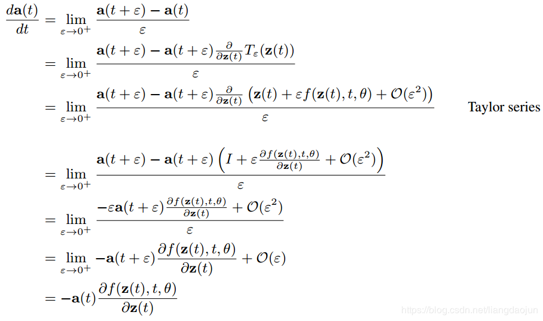
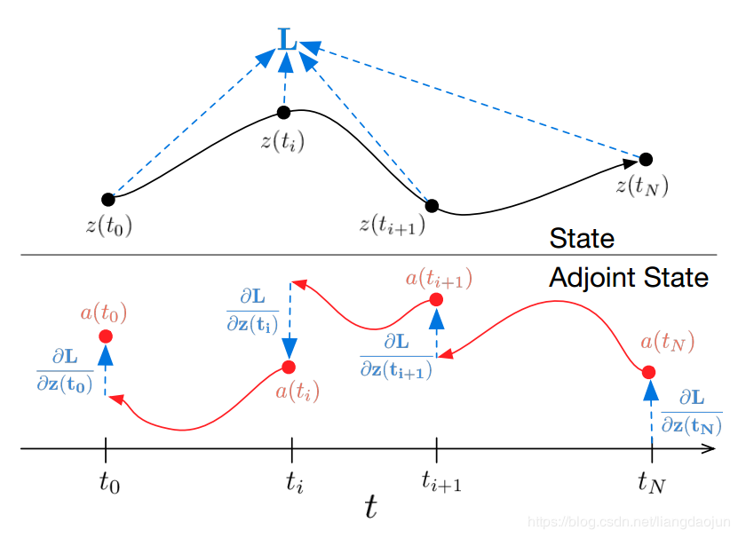
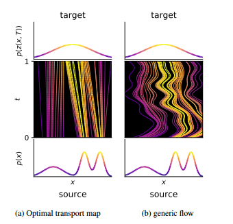
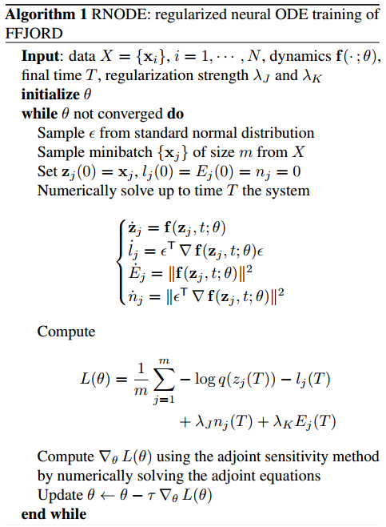

> 本文将从动力学系统角度去理解深度神经网络。<!--more-->

## Neural ODE

* Euler method:
  $$
  h_N = h_{N-1} + \Delta tg((N-1)\Delta t, h_{N-1})
  $$

* ResNet
  $$
  h_{l+1} = h_{l} + NNetwork(h_l)
  $$
  不同之处在于 ： ResNet每一步都有不同的参数，而常微分方程参数是共享的

* Memory Cost: O(1), 并且是可逆的

* 类似于ResNet的连接方式
  $$
  h_{t+1} = h_t + f(h_t, \theta_t)\\
  \frac{dh_t}{dt} = f(h(t), t, \theta)
  $$

* 定义Loss Function:
  $$
  L(z(t_1)) = L( z(t_0) + \int_{t_0}^{t_1}f(z(t), t, \theta)dt) = L(ODESolve(z(t_0), f, t_0, t_1, \theta))
  $$
  当使用Euler Method 去解决$\frac{dh(t)}{dt} = NNetwork(h(t), t, \theta)$时， 则有迭代公式为
  $$
  h_{k} = h_{k-1} + NNetwork(h_{k-1})
  $$
  那么， 损失的梯度可以表示为
  $$
  \frac{\partial L}{\partial \theta} = \frac{\partial loss(h_k,y_{targets}; \theta)}{\partial \theta}
  $$
  当然，此处可以使用其他数值解法，如RK2, RK4等等，但是存在以下**问题**， 如果**时间步数很多**，则会产生内存问题；此外，由于数值错误或者不稳定性甚至是求解器本身的不可微性，会导致反向传播无法进行。

* 伴随敏感度方法：

  * define $z(t+ \epsilon) = \int ^{t+\epsilon}_t f(z(t), t, \theta)dt + z(t) = T_\epsilon(z(t), t)$, and $a(t) = \frac{dL}{dZ(t)}$

    we can get
    $$
    \frac{dL}{dz(t)} = \frac{dL}{dz(t+\epsilon)} \frac{dz(t+\epsilon)}{dz(t)} \longrightarrow a(t) = a(t+ \epsilon) \frac{dT_{\epsilon}(z(t),t)}{dz(t)}
    $$

  * 下面证明 $\frac{da(t)}{dt}= -a(t)^T \frac{df(z(t), t, \theta)}{dz}$

    

  * 因此，整体前向和反向传播网络如下图所示：

    

  * 下面讨论损失函数对于$\theta$的梯度，和上述几乎同样的推导过程。

整体推导过程：
$$
\frac{d}{dt}\begin{bmatrix}
z\\
\theta\\
t
\end{bmatrix}(t) = f_{aug}([z, \theta, t]):=\begin{bmatrix}
f([z,\theta, t])\\
0\\
1\\
\end{bmatrix}
$$

$$
a_{aug}:=\begin{bmatrix}
a\\a_{\theta}\\a_{t}
\end{bmatrix}
$$

其中 $a_{\theta}(t):=\frac{dL}{d\theta(t)}, a_t(t):=\frac{dL}{dt(t)}$

f函数的雅可比矩阵为 
$$
\frac{\partial f_{aug}}{\partial [z, \theta, t]}=\begin{bmatrix}
\frac{\partial f}{\partial z}& \frac{\partial f}{\partial \theta}&\frac{\partial f}{\partial t}\\
0&0&0\\
0&0&0\\
\end{bmatrix}(t)
$$
则类似上述推导可以得出对应的伴随敏感状态为
$$
\frac{d a_{aug}(t)}{dt} = -[a(t)~~ a_{\theta}(t)~~ a_t(t)] \frac{\partial f_{aug}}{\partial [z, \theta, t]}(t) = -[a\frac{\partial f}{\partial z}~~ a\frac{\partial f}{\partial \theta}~~a\frac{\partial f}{\partial z}](t)
$$

## Deep Equilibrium Models

>  整体思想是权重共享，然后将输入不断得给到一个layer中去，假设最终收敛，称之为不动点。

$$
\lim_{i\rightarrow \infty}z_{1:T}^{[i]}=\lim_{i\rightarrow \infty}f_{\theta}(z_{1:T}^{[i]};x_{1:T})\equiv f_{\theta}(z_{1:T}^*;x_{1:T})=z^*_{1:T}
$$

* Back propagation: $(.)$代表$f_{\theta}(z_{1:T}^*;x_{1:T})$中的参数（比如$\theta, x_{1:T}$）
  $$
  \frac{\partial z_{1:T}^*}{\partial(.)} = \frac{df_\theta(z^*_{1:T};x_{1:T})}{d(.)} + \frac{\partial f_{\theta}(z^*_{1:T};x_{1:T})}{\partial z^*_{1:T}}\frac{\partial  z^*_{1:T}}{\partial (.)}
  $$
  因此可得
  $$
  \begin{equation}
  \begin{aligned}
      (I-\frac{\partial f_{\theta}(z^*_{1:T};x_{1:T})}{\partial z^*_{1:T}})
  \frac{\partial  z^*_{1:T}}{\partial (.)} &= \frac{df_{\theta}(z^*_{1:T};x_{1:T})}{d(.)}\\
  \end{aligned}
  \end{equation}
  $$
  令 $g_{\theta}(z_{1:T}^\star)=f_{\theta}(z^\star_{1:T};x_{1:T})-z_{1:T}^\star$ ,可得
  $$
  \begin{equation}
  \begin{aligned}
  J_{g_{\theta}\big|{z_{1:T}^*}} &= -    (I-\frac{\partial f_{\theta}(z^*_{1:T};x_{1:T})}{\partial z^*_{1:T}})\\
  \frac{\partial z_{1:T}^*}{\partial(.)} &= -J^{-1}_{g_{\theta}}\big|_{z_{1:T}^*}\frac{df_{\theta}(z_{1:T}^*;x_{1:T})}{d(,)}\\
\frac{\partial l}{\partial (.)} &= \frac{\partial l}{\partial z_{1:T}^*}\frac{\partial z_{1:T}^*}{\partial(.)}
  \end{aligned}
  \end{equation}
  $$
  
* 对于不动点进行估计的有效方法
  $$
  g_{\theta}(z_{1:T}^*;x_{1:T}) =f_{\theta}(z_{1:T}^*;x_{1:T})-z_{1:T}^*\rightarrow 0
  $$
  并采用拟牛顿法中的Broyden方法对于雅可比矩阵的逆进行近似
  $$
  J^{-1}_{g_{\theta}}\big|_{z_{1:T}^*} \approx B_{g_\theta}^{[i+1]} = B_{g_\theta}^{[i]} + \frac{\Delta z^{[i+1]} - B_{g_{\theta}}^{i}\Delta g_{\theta}^{[i+1]}}{\Delta z^{[i+1]^T}B_{g_{\theta}}^{[i]}\Delta g_{\theta}^{[i+1]}}\Delta z^{[i+1]^T}B_{g_{\theta}}^{[i]}
  $$
  其中$\Delta z^{[i+1]} = z_{1:T}^{[i+1]}-z_{1:T}^{[i]}$, $\Delta g_{\theta}^{[i+1]} = g_{\theta}(z_{1:T}^{[i+1]};x_{1:T}) - g_{\theta}(z_{1:T}^{[i]};x_{1:T})$,初始$g_{\theta}$可以设置为0.

* 另一种方案是back propagation直接计算 $-\frac{\partial l}{\partial z_{1:T}^\star}J^{-1}_{g_{\theta}}\big|_{z_{1:T}^\star}$
  $$
  J^{^T}_{g_{\theta}}\big|_{z_{1:T}^*} x^T + (\frac{\partial l }{\partial z_{1:T}^*})^T = 0
  $$
  然后用拟牛顿法来解这个问题

## ODE2VAE

对于下述问题：
$$
\ddot z_t = \frac{d^2 z_t}{d^2 t}=f_{W}(z_t, \dot z_t)
$$
 可以等价变为两个一阶ode的形式
$$
\begin{equation}
\begin{aligned}
\dot s_t &= v_t\\
\dot v_t &= f_W(s_t, v_t)
\end{aligned}
\end{equation}\\
$$
即 
$$
\begin{bmatrix}
s_T\\
v_T
\end{bmatrix} =\begin{bmatrix}
s_0\\
v_0
\end{bmatrix} + \int^T_0\begin{bmatrix}v_t\\f_W(s_t, v_t)
\end{bmatrix}dt
$$
其中$W=\{W_l\}_{l=1}^L$，表示L层中所有的权重和偏差参数，假设对$p(W)$进行一个先验的假设，则对此进行采样，就会确定一个神经网络，从而决定ODE的轨迹

### 二阶ODE流模型

对于上述的ODE模型，根据Neural ODE中的结果，可知
$$
\frac{\partial \log q(z_t|W)}{\partial t} = -Tr(\frac{d\tilde f_W(z_t)}{dz_t}) = -Tr\begin{pmatrix}
\frac{\partial v_t}{\partial s_t}&\frac{\partial v_t}{\partial v_t}\\
\frac{\partial f_W(s_t, v_t)}{\partial s_t}&\frac{\partial f_W(s_t, v_t)}{\partial v_t}
\end{pmatrix}= -Tr(\frac{\partial f_W(s_t, v_t)}{\partial v_t})
$$
从而可知
$$
\log q(z_T|W)=\log q(z_0|W) - \int^T_0Tr(\frac{\partial f_W(s_t, v_t)}{\partial v_t})dt
$$

### ODE2VAE模型

infer在低维空间上的速度和位置轨迹，但是仍然能将数据拟合的很好。下面假设动态方程：
$$
\begin{equation}
\begin{aligned}
s_0&\sim p(s_0)\\
v_0 &\sim p(v_0)\\
s_t &= s_0 + \int^t_0v_\tau d\tau\\
v_t &= v_0 + \int^t_0 f_{true}(s_\tau, v_\tau)d\tau\\
x_i &\sim p(x_i|s_i), i\in [0,N]\\
\end{aligned}
\end{equation}
$$
下面给出变分推断基本假设
$$
\begin{equation}
\begin{aligned}
q(W, z_{0:N}|x_{0:N}) &= q(W)q_{enc}(z_0|x_{0:N})q_{ode}(z_{1:N}|x_{0:N},z_0,W)\\
q(W) &= \mathcal{N}(W|m. sI)\\
q_{enc}(z_0|x_{0:N})&=q_{enc}\big( \begin{pmatrix}s_0\\v_0\end{pmatrix}\big| x_{0:N}\big)\\
&= \mathcal{N}\big(\begin{pmatrix}\mu_s(x_0)\\\mu_v(x_{0:m)}\end{pmatrix}, \begin{pmatrix}
diag(\sigma_s(x_0))&0\\
0&diag(\sigma_v(\sigma_v(x_{0:m})\big)
\end{pmatrix})
\end{aligned}
\end{equation}
$$

#### ELBO

$$
\begin{equation}
\begin{aligned}
\log p(X) &\geq -KL(q(W,Z|X)||p(W,Z)) + E_{q(W,Z|X)}[\log p(X|W,Z)]\\
&= -E_{q(Z,W|X)}[\log\frac{q(W)q(Z|W,X)}{p(W)p(Z)}] + E_{q(Z,W|X)}[\log p(X|W,Z)]\\
& = -KL(q(W)||p(W))+ E_{q(Z,W|X)}[-\log \frac{q(Z|W,X)}{p(Z)} + \log p(X|W,Z)]\\
&=-KL(q(W)||p(W)) + E_{q_{enc}(z_0|X)}[-\log \frac{q_{enc}(z_0|X)}{p(z_0)} + \log p(x_0|z_0)]\\
&+ \sum^N_{i=1}E_{q_{ode}(W,z_i|X,z_0)}[-\log \frac{q_{ode}(z_i|W,Z)}{p(z_i)} + \log p(x_i|z_i)]
\end{aligned}
\end{equation}
$$

其中，先验分布 $p(W,z_0)$是标准高斯分布。

* 文章对于损失函数的改进，

  * 提出问题
    * VAE模型优化ELBO不一定得到正确的inference。
    * KL项和重构项存在不平衡的矛盾。----->加权
    * 在此问题中，encoder只是为了得到最初的$z_0$，对于长时预测问题或在小数据或初始数据分布和数据分布不一致时，(26)中动态损失项(第三项)，很容易支配VAE的损失，引起欠拟合-------> 减少编码器分布和ODE流分布之间的距离
  * 方案：
    * 对于$-KL(q(W)||p(W))$，增加一个权重$\beta=|q|/|W|$,表示因空间维度和权重数目的比。
    * 减少编码器分布和ODE流分布之间的距离

  $$
  \begin{equation}
  \begin{aligned}
  L & =-\beta KL(q(W)||p(W))+ E_{q(Z,W|X)}[-\log \frac{q(Z|W,X)}{p(Z)} + \log p(X|W,Z)]\\
  &-\gamma E_q(W)[KL(q_{ode}(Z|X) || q_{enc}(Z|W,X)]
  \end{aligned}
  \end{equation}
  $$

  

## FFJORD: free form continuous dynamics for scalable reversible generative models

对于CNF，根据neural ode 中有
$$
\frac{d\log p(\vec z(t))}{dt} = -tr(\frac{df}{dz(t)})
$$
因此，对于增广状态有，
$$
\begin{bmatrix}
z_0\\
\log p(x) - \log p_{z_0}(z_0) 
\end{bmatrix} = \int_{t_1}^{t_0}
\begin{bmatrix}
f(z(t),t;\theta)\\
-Tr(\frac{\partial f}{\partial z(t)})
\end{bmatrix}dt\\
\begin{bmatrix}
z(t_1)\\
\log p(x)-\log p(z(t_1))
\end{bmatrix} = \begin{bmatrix}
x\\0
\end{bmatrix}
$$
根据下述重要推论中的第二条，可知
$$
\begin{equation}
\begin{aligned}
\log p(z(t_1)) &= \log p(z(t_0)) - \int_{t_0}^{t_1}Tr(\frac{\partial f}{\partial z(t)})dt\\
&= \log p(z(t_0)) - \mathbb{E}_{p(\epsilon)}\big[ \int_{t_0}^{t_1}\epsilon^T \frac{\partial f}{\partial z(t)}\epsilon dt \big]
\end{aligned}
\end{equation}
$$

## How to train your Neural ODE

> 对于一般的ODE，积分步长相当于堆叠了很多层的layer，本篇文章引入了正则化来缓解这种问题。最终达到用**更简单的动力学方程有更快的收敛速度**，仅**需要更少的离散化步骤求解**。 Neural ODE 可以节省内存开销，但需要很长的时间训练。

* **为什么需要正则化？**从下述图中可看出，两模型输入输出相同，但右图中局部特性不理想，比如局部轨迹变化大，速度不均匀等。左图更加规则。

  

* **如何measure vector field是否“规则”？**  评估在各点$z(t)$所受的“力”，也就是
  $$
  \begin{equation}
  \begin{aligned}
  \frac{df(x, t)}{dt} &= \nabla f(z, t) , \dot z + \frac{\partial f(z, t)}{\partial t}\\
  &=\nabla f(z,t)f(z, t) + \frac{\partial f(z, t)}{\partial t}
  \end{aligned}
  \end{equation}
  $$
  因此，引入两个正则化项：一个是为了对f正则化，另一个则是对$\nabla f$正则化

  * 评估流f行走的距离，也可认为是流模型的动能。
  * 对于vector field中的雅可比行列式进行正则化

* 采用Optimal Transport问题中的Benamou-Brenier方法，引入惩罚项

  首先，介绍Optimal  Transport, 假设有两个分布  $p(x), q(x)$，及映射  $z:p(x)->q(z)$，则应最小化传输代价
  $$
  M(t) = \int||x-z(x)||^2 p(x)dx
  $$
  如果将映射$z(x,T)$写为通过ODE函数f得到的一个映射，则可转化为
  $$
  \begin{equation}
  \begin{aligned}
  \min_{f, \rho} \int^T_{0}&\int ||f(x, t)||^2 \rho_t(x)dxdt\\
  subject~~~to&\\
  \frac{\partial \rho_t}{\partial t} &= -div(\rho f)\\
  \rho_0(x) &= p\\
  \rho_T(x) &= q\\
  \end{aligned}
  \end{equation}
  $$
  此式是(32)式的上界，只有当在最优的时候才会和（32）相等，而后，为了保证$\rho_T(z)=q$，引入KL散度，且恰好可以简化成以下形式($\rho_0 = p_{\theta}$)
  $$
  KL(\rho_T||q) = -\frac{1}{N} \sum^N_{i=1}\log p_{\theta}(x_i)
  $$
  此时(33)变为
  $$
  J_{\lambda}(f) = \frac{\lambda}{N}\sum^N_{i=1}\int^T_{0}||f(z, t)||^2dt -\frac{1}{N} \sum^N_{i=1}\log p_{\theta}(x_i)
  $$
  **第一项即为添加的正则项**

* 可发现即使f正则化到很小，如果雅可比矩阵很大，那么（31）依然很大，因此，引入雅可比矩阵的F范数来进行正则化
  $$
  ||\nabla f(z)||^2_F = E_{\epsilon \sim N(0,1)} \epsilon^T \nabla f(z)\nabla f(z)^T\epsilon = E_{\epsilon \sim N(0,1)}||\epsilon^T \nabla f(z)||^2
  $$

#### 最终算法实现

