> 本节将会介绍生成模型中非常典型的一类方法，流模型 。<!--more-->

### NICE: Non-linear Independent Components Estimation

* 对于一个数据分布 x，通过一个可逆映射 f(x), 可以变成另外一个分布y，则两者之间概率密度分布之间的关系为

$$
p(x) = p(y)|\det \frac{\partial f(x)}{\partial x}|\\
$$

* 对于函数f有两个要求：

  * 可逆，且容易求其逆函数
  * 对应的雅可比行列式容易计算

* NICE采用加性耦合层
  $$
  h_1= x_1\\h_2= x_2+m(x_1)
  $$
  可以算出，对应的雅可比矩阵是下三角阵，且对角元素为1，故而行列式为1，采用多个耦合层相连，可以增加表达能力。

  但是上述存在一定问题，即使多次连接，第一部分仍然是**恒等变换**，故而作者提出交换顺序来进行耦合。

  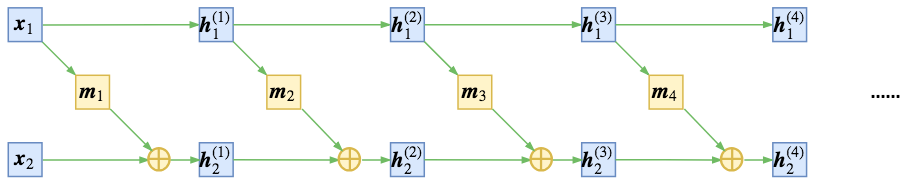

* 然而，正是由于模型是可逆的，因此最终z和x的维度是一致的，然而实际上，往往数据具有高维空间的低维流形，因此，引入尺度变换层，对于编码出来的每个维度的特征做尺度变换即
  $$
  z = s\otimes h^{(n)}
  $$
  其中s也是要训练优化的参数，可以识别出该维度的重要性，可以起到压缩流形的作用。

  此时行列式变为了 $\Pi_i s_i$

  实际上**尺度变换层等价于将先验分布的方差（标准差）也作为训练参数，如果方差足够小，我们就可以认为该维度所表示的流形坍缩为一个点，从而总体流形的维度减1，暗含了降维的可能**。

* 实验结果：

  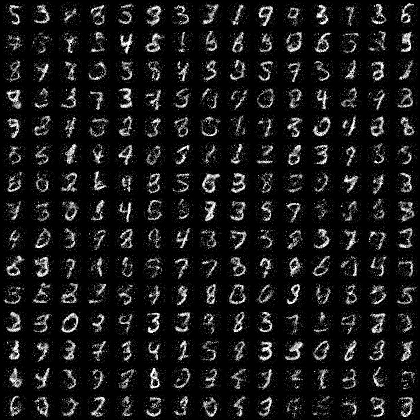

###  REALNVP

* REAL NVP是在NICE基础上进行改进的结果

* 仿射耦合层
  $$
  h_1 = x_1\\
  h_2 = s(x_1)\otimes x_2 +t(x_1)
  $$
  此时，对应的雅可比行列式的值为$\Pi_i s(x_1)_i$, 注意，为了保持可逆性，一般将s各个元素约束为大于0.

* 在NICE中，是交替进行混合信息流，REALNVP则是采用shuffle的方式，将信息充分耦合

  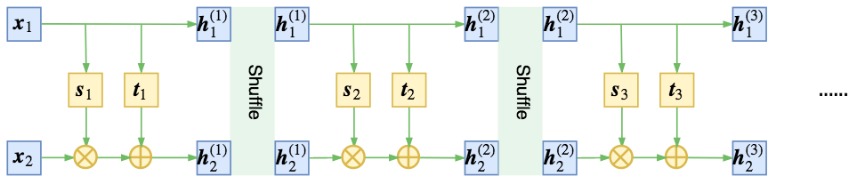

* 引入卷积层，对于图像来说，随意shuffle会打乱空间之间的相关性，因此作者引入以下几种方式来进行分割

  

* 多尺度结构： 启发于VGG网络，有点分形的味道

  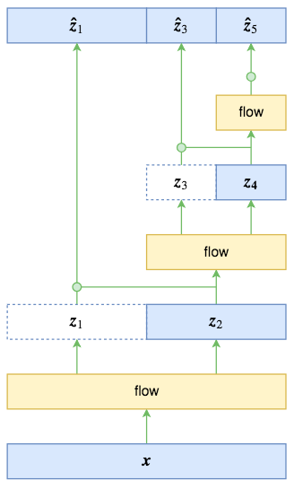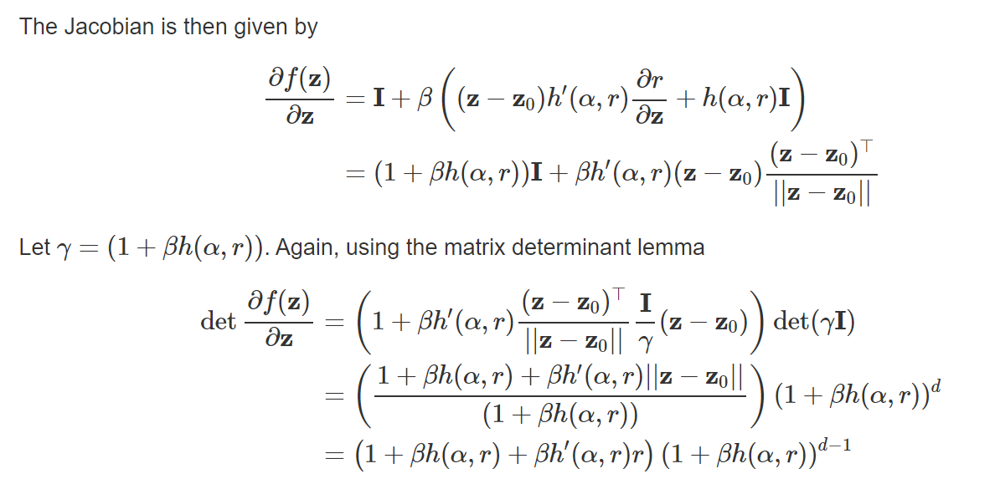

可以得到
$$
p(z_1, z_3, z_5)=p(z_1|z_2)p(z_3|z_4)p(z_5)\\
$$
并假设$\hat z_1, \hat z_3, \hat z_5$服从标准正态分布，相较于直接输出，条件概率输出具有更大的灵活性。
$$
\hat z_1 = \frac{z_1-\mu(z_2)}{\sigma(z_2)}\\
\hat z_3 = \frac{z_3-\mu(z_4)}{\sigma (z_4)}\\
\hat z_5 = \frac{z_5-\mu}{\sigma_z}\
$$

### GLOW

* GLOW模型是在NICE及REALNVP基础上改的，NICE和REALNVP中采用不同的方式打乱顺序，而注意到**向量的置换操作，可以看作是向量乘一个置换矩阵得到的**，GLOW中**将置换矩阵作为一个可训练的参数矩阵**，并因此引入了**可逆$1\times1$卷积**

* 另一点是引入**ActNorm**， 也就是对于z进行缩放平移变换
  $$
  \hat z = \frac{z-\mu}{\sigma}
  $$
  其中$\mu$和$\sigma$都是训练参数，在**初始化的时候是数据的均值和方差**

###  Variational inference with normalizing flows

* Invertible Linear-Time Transformations（可逆线性变换层）**planar flows**
  $$
  f(z)=z+uh(w^Tz+b)
  $$
  其中h为线性变换， 则可知
  $$
  \psi(z)=h'(w^Tz+b)w\\
  \det |\frac{\partial f}{\partial z}| = |\det(I +u\psi(z)^T)|=|1+u^T\psi(z)|
  $$
  其中$u^T\psi(z)$是一个数。
  $$
  z_k= f_k\circ f_{k-1}\circ\cdots\circ f_1(z)\\
  \ln q_k(z_k)=\ln q_0(z) -\sum^K_{k=1}\ln |1+u_k^T\psi_k(z_k)|
  $$

* 改变变换形式，将变换改为将$q_0$绕某一个参考点去变化，
  $$
  f(z)=z+\beta h(\alpha,r)(z-z_0)\\
  \det |\frac{\partial f}{\partial z}|=(1+\beta h +\beta h' r)(1+\beta)^{d-1}
  $$
  
* 

### MADE: Masked Autoencoder for Distribution Estimation 

参考https://github.com/karpathy/pytorch-made

### wavenet: a generative model for raw audio

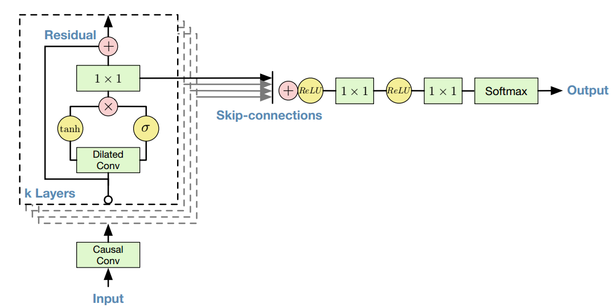

可参考https://github.com/ibab/tensorflow-wavenet，其中causal conv可以表示为

### 	Improved Variational Inference with Inverse Autoregressive Flow 

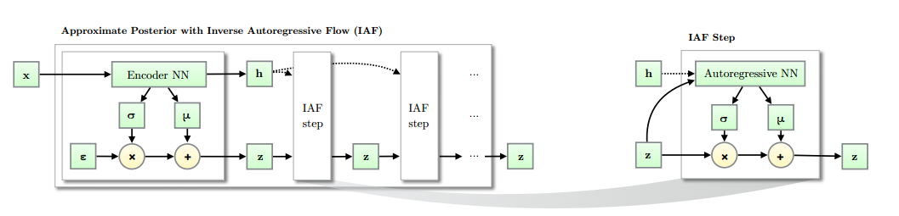

* 相比于normalizing flow中常见的planar nf采用mlp的形式，表达能力欠缺，且在更高维度下需要更长的链转换概率密度，因此不适应于高维空间。

* 算法结构如下

  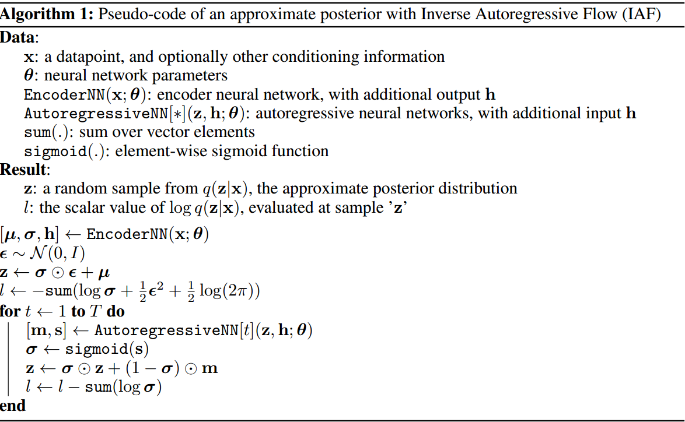

  * 其中AutogressiveNN可以选择很多种，**对于MLP类型的，可以选择MADE的形式**；**对于卷积类型的，可采用pixel cnn中的形式**，参考https://github.com/pclucas14/iaf-vae

### Sylvestrer Normalizing flows for Variance Inference

* 首先提出**Sylvester determinant identity**，对于$A\in R^{D\times M}, B\in R^{M\times D}$, 有
  $$
  \det (I_D+AB) = \det (I_M+BA)
  $$

* 对于形如（13）的形式，其中$A\in R^{D\times M}, B\in R^{M\times D}, b\in R^{M}, M<D$根据（1）式可以得到(14)，从而降低计算量。
  $$
  z'= z + Ah(Bz+b)
  $$

  $$
  \det (\frac{\partial z'}{\partial z}) = \det (I_M + diag (h'(Bz+b)BA))
  $$

* 需要解决的问题是，(12)式一般是不可逆的，且行列式不好计算，因此引入QR分解，考虑如下特殊形式
  $$
  z' = z + QR^Ah(R^BQ^Tz=b)\\
  \det (\frac{\partial z'}{\partial z}) = \det (I_M + diag(h')R^BR^A)
  $$
  下面**证明可逆**：如果$R^A, R^B$是上三角阵，且h是光滑有界的函数，且导数为正，则如果$R^A, R^B$对角元素满足$R^A_{ii}R^B_{ii}>-1/||h'||_{\infty}$，则(15)式可以保证是可逆的

### Continuous  Normalizing Flow

* Neural ODE中提出CNF的概念
  $$
  \frac{d\vec z}{dt}=\vec f(\vec z(t), t)\\
  \vec z(0)\sim p_o(\vec z(0))\\
  \vec z(T) = \vec z(0) + \int _0^T\vec f(\vec z(t), t)dt\\
  \frac{d\log p(\vec z(t))}{dt} = -tr(\frac{df}{dz(t)})
  $$

#### FFJORD: free form continuous dynamics for scalable reversible generative models

对于CNF，根据neural ode 中有
$$
\frac{d\log p(\vec z(t))}{dt} = -tr(\frac{df}{dz(t)})
$$
因此，对于增广状态有，
$$
\begin{bmatrix}
z_0\\
\log p(x) - \log p_{z_0}(z_0) 
\end{bmatrix} = \int_{t_1}^{t_0}
\begin{bmatrix}
f(z(t),t;\theta)\\
-Tr(\frac{\partial f}{\partial z(t)})
\end{bmatrix}dt\\
\begin{bmatrix}
z(t_1)\\
\log p(x)-\log p(z(t_1))
\end{bmatrix} = \begin{bmatrix}
x\\0
\end{bmatrix}
$$
根据下述重要推论中的第二条，可知
$$
\begin{equation}
\begin{aligned}
\log p(z(t_1)) &= \log p(z(t_0)) - \int_{t_0}^{t_1}Tr(\frac{\partial f}{\partial z(t)})dt\\
&= \log p(z(t_0)) - \mathbb{E}_{p(\epsilon)}\big[ \int_{t_0}^{t_1}\epsilon^T \frac{\partial f}{\partial z(t)}\epsilon dt \big]
\end{aligned}
\end{equation}
$$

* 上述对$Tr(A)$估计中的variance渐进趋向于 $||A||_F^2$,为了减少Hutchinson估计器的variance,作者提出用降低维度的方式，设 $f=g\circ h(z)$,则有
  $$
  Tr(\frac{\partial f}{\partial z}) = Tr(\frac{\partial g}{\partial h}\frac{\partial h}{\partial z}) = Tr(\frac{\partial h}{\partial z}\frac{\partial g}{\partial h}) = \mathbb{E}_{p(\epsilon)}[\epsilon^T\frac{\partial h}{\partial z}\frac{\partial g}{\partial h}\epsilon]
  $$
  第二项是$D\times D$维的，第三项则是 $H\times H$维的，如果H是很小的，那么我们就可以减少估计器的方差。

### GRU-ODE_Bayes

* 特点：
  * 快速推断潜在随机过程的位置参数
  * 学习变量中的相关性
* GRU-ODE包括两部分：
  * GRU-ODE：基于GRU的ODE模型，使得隐状态h能够沿时间传播
  * GRU-Bayes：通过观测数据来更新当前的因状态

#### GRU-ODE 推导

* 对于基本GRU单元，其结构如图所示：

  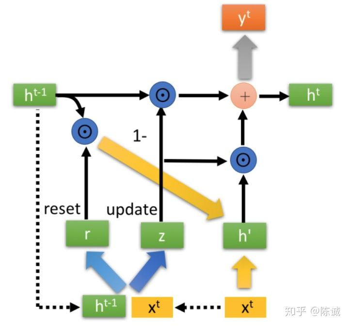
  $$
  \begin{equation}
  \begin{aligned}
  r_t &= \sigma(W_rx_t + U_rh_{t-1}+b_r)\\
  z_t &= \sigma(W_zx_t + U_zh_{t-1}+b_z)\\
  g_t &= tanh(W_h x_t + U_h(r_t\odot h_{t-1})+b_h)\\
  h_t &= z_t\odot h_{t-1} + (1-z_t)\odot g_t\\
  \end{aligned}
  \end{equation}
  $$
  因此，可得隐状态变化为
  $$
  \begin{aligned}
  \Delta h_t &= h_t - h_{t-1} = z_t\odot h_{t-1} + (1-z_t)\odot g_t -h_{t-1}\\
  &=(1-z_t)\odot (g_t-h_{t-1})
  \end{aligned}
  $$
  可将隐状态微分方程变为
  $$
  \frac{dh(t)}{dt} =(1-z(t))\odot (g(t)-h(t))
  $$

* GRU-ODE 特性：
  * 有界性： 如果初始状态 $h(0)_j\in [-1, 1]$, 则$h(t)_j$则一直在此界内
  * 连续性： GRU-ODE是李普希兹连续的，且K=2
  * 支持各种数值求解器：例如欧拉解法，中值法等

#### GRU-bayes

* 为了用观测值对隐状态进行更新， 并估计$Y(t)$的概率密度函数； 采用标准GRU模块并在[-1,1]内进行变换

* 定义$f_{prep}$函数对于观测数据进行预处理：（通过隐状态h计算观测值概率密度函数的参数，假设是高斯函数）
  $$
  \theta = [mean, logvar] = f_{obs}(h(t))\\
  error = (y[k]_d - mean)/e^{0.5*logvar}\\
  q_d = [y[k]_d, mean, logvar, error]\\
  f_{prep} = ReLU(W_dq_d + bias) * m_d\\
  h(t_+) = GRU(h(t_-), f_{prep}(y[k], m[k], h(t_-))\\
  $$
  其中$h(t_-)$和 $h(t_+)$为GRU-Bayes前后的状态，因此，状态在此时会有一个跳跃。m是mask‘函数，结果中没有观测值的位置直接置0

  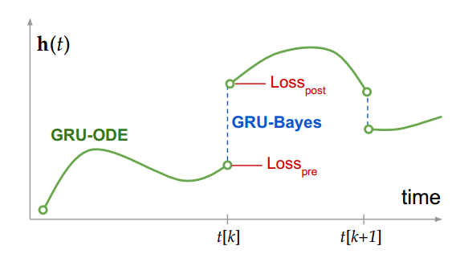

* 目标函数： $Loss_{pre} + \lambda Loss_{post}$
  $$
  Loss_{pre} = -\sum^D_{j=1}m_j\log p(y_j|\theta=f_{obs}(h_-)_j)\\
  Loss_{post} = \sum^D_{j=1}m_jD_{KL}(p_{Bayes,j}||p_{post,j})
  $$
  其中第一项假设的是高斯分布；第二项损失中$p_{Bayes,j} \propto p_{pre,j}p_{obs,j}$, $p_{pre}$为GRU-Bayes之前的预测分布， $p_{post,j}$表示GRU-Bayes之后的预测分布。

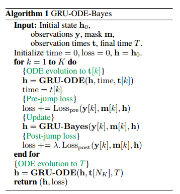

* $p_{Bayes,j} $计算：对于二项式和高斯分布，可以解析表示：
  $$
  \mu_{bayes} = \frac{\sigma_{obs}^2}{\sigma^2_{pre} +  \sigma_{obs}^2}\mu_{pre} + \frac{\sigma_{pre}^2}{\sigma^2_{pre} +  \sigma_{obs}^2}\mu_{obs}\\
  \sigma_{bayes}^2 = \frac{\sigma^2_{pre} \sigma^2_{obs}}{\sigma^2_{pre} + \sigma^2_{obs}}
  $$
  实际上，往往观测值的方差$\sigma^2_{obs}<<\sigma^2_{pre}$,此时 $\mu_{bayes}=\mu_{obs}, \sigma_{bayes}^2 = \sigma^2_{obs}$

### 重要推论：

* CNF中的结论
  $$
  \begin{equation}
  \begin{aligned}
  \frac{d\vec z}{dt}=&\vec f(\vec z(t), t)\\
  \vec z(0)\sim p_o(\vec z(0))&~~~\vec z(T) = \vec z(0) + \int _0^T\vec f(\vec z(t), t)dt\\
  \frac{d\log p(\vec z(t))}{dt} =& -tr(\frac{df}{dz(t)})
  \end{aligned}
  \end{equation}
  $$
  
* 假设p(u)是多元概率分布，均值为0，协方差为单位阵，则对于任意矩阵A，有
  $$
  Tr(A)=E_{u\sim p(u)}[u^TAu]
  $$
  证明如下
  $$
  u^TAu = \sum_{j=1}^N\sum_{i=1}^Nu_{i}u_{j}A_{ij}
  $$
  
  $$
  \begin{equation}
  E[u_iu_j] = \left\{
  \begin{aligned}
  1,i=j\\
  0, i\neq j
  \end{aligned}
  \right.
  \end{equation}
  $$
  
* 证明恒等式

$$
\det (exp(A)) = exp(Tr(A))\\
  ln (\det B) = Tr(\ln B)
$$