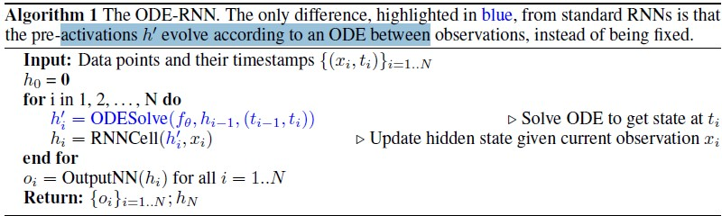
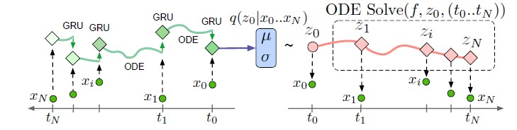
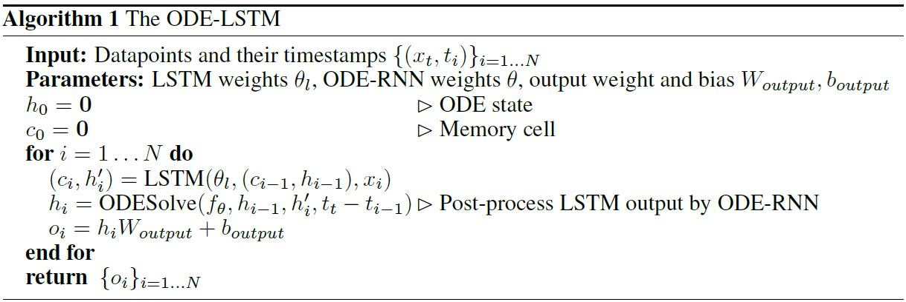

本文将对于非周期采样时序数据的预测问题做一个初步的总结<!--more-->
>
>RNN对于周期采样的数据是比较合适的，但是对于非周期采样的时序数据是很难处理的。
>
>* 常见trick是将此问题在预处理层面进行解决，即做聚合/插补---缺点是会损失一部分信息
>* 类似于ODE-RNN的形式，在观测点对于状态进行调整

## latent odes for irregular sampled time series

> 本文提出了两种形式的ODE-RNN

* 第一种与标准RNN的区别仅在于蓝色高亮的部分，即在观测之间采用ODE来模拟数据的变化，而不是像RNN中观测之间的状态是不变的。

* 第二种整体是一个seq2seq模型。首先通过编码器得到初始隐变量$z_0$，此时采用neural ode来模拟隐藏状态的变化，得到$z_0, z_1, ...,z_N$；最后通过解码器对每一个时刻的隐变量进行解码重构。**需要注意的是，为估计初始的$z_0$, ODE-RNN的编码器是时间反序来求解的**

  * 编码器采用的是$ODE-RNN$模型，并假设初始状态$z_0$分布为
    $$
    q(z_0|\{x_i, t_i\}_{i=0}^N)=\mathcal{N}(\mu_{z_0}, \sigma_{z_0})
    $$
    其中， $\mu_{z_0}, \sigma_{z_0}=g(ODE-RNN(\{x_i,t_i\}_{i=0}^N))$, g为神经网络。

  * 对应此种形式的损失函数为：
    $$
    \text{ELBO}(\theta, \phi) = \mathbb{E}_{z_0\sim q_{\phi(z_0|\{x_i, t_i\}_{i=0}^N)}}[\log p_{\theta}(x_0, ...,x_N)] - \text{KL}[q_{\phi}(z_0|\{x_i,t_i\}_{i=0}^N)||p(z_0)]
    $$

  > 上述通过隐变量来重构的框架有以下几个优点：
  >
  > * 显式得将ODE系统的动态特性，观测似然值以及辨识模型分别开来，因此可以有效区分每一部分的作用
  > * 采用VAE的框架，能够自然的建模不确定性
  > * 对于非周期采样的时序数据建模提供了便捷性

* 更多的观测意味着更多的信息，也就是说采样的频率在一定程度上能够反映数据的重要性。这是一个典型的counting process，假设他是一个非齐次的泊松过程，对应的强度函数为 $\lambda(z(t))$(即这里假设$\lambda$是z(t)的函数)，则可以推导出
  $$
  \log p(t_1, t_2, ...,t_N|t_{starrt}, t_{end}) = \sum^N_{i=1}\text{log}\lambda(z(t_i)) - \int^{t_{end}}_{t_{start}}\lambda(z(t))dt
  $$

  > 推导过程请参考[refer](https://math.stackexchange.com/questions/344487/log-likelihood-of-a-realization-of-a-poisson-process)

## Learning Long Term Dependencies in Irregularly Sampled Time Series

> ODE_RNN无法解决长时依赖问题，根本原因是ODE得到的隐藏状态会产生梯度消失会爆炸现象，而后提出ODE-LSTM的基本框架，讲记忆单元和对应的连续时间态进行显式分离，并实验真证明了有效性。

## GRU-ODE-Bayes: Continuous Modeling of Sporadically-Observed Time Series

> 见 Dynamic systems for Deep Learning 