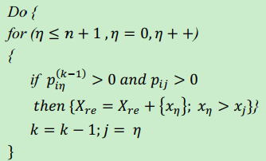

### Main Thoughts

- First analyses the workflow log transition probabilities between activities to build the Markov transition matrix;
- Then mines the process logic relationship by defining a set of rules of logical relational
- At last design the process mining algorithm to establish the actual structure relationship between the activities in order to reconstruct the workflow.  

### Methods to find incomplete logs

- List the set of the end events of the log, if an instance's log end event does not belong to the set
- If a task only has the start event without a corresponding end event

### Symbol Description

| symbol        | meaning                     | symbol                  | meaning                |
| ------------- | --------------------------- | ----------------------- | ---------------------- |
| n             | execution times of workflow | $X = \{x_0,x_1...x_k\}$ | set of activities      |
| P             | workflow transition matrix  | $X_s$                   | start process          |
| $X_E$         | end process                 | >                       | sequence relationship  |
| $\rightarrow$ | casual relationship         | #                       | selection relationship |
| //            | synchronous relationship    | $\diamond$              | circle relationship    |

### Build Markov Transition Matrix

- $p_{ij} = m_{ij}/n$, $m_{ij}$ means the one step transition times from activity $x_i$ to $x_j$ in the n workflow instances

### Logic Relationship Mining Rules

- (1) **Start of the process**:  $\exists x_j \in X$, and $\forall x_i~\in~X$, if $p_{ij} = 0$, then $X_s = x_j$

- (2) **End of the process**: $\exists x_i \in X$, and $\forall x_j \in X$, if $p_{ij} = 0$, then $X_E = xi$

- (3) **Sequence relationship**: $\forall x_i,~x_j \in X$, if $p_{ij} \neq 0$, then $x_i >x_j$

- (4) **Casual relationship**: $\forall x_i,~x_j \in X$, if $p_{ij} = 1$, then$x_i \rightarrow x_j$

- (5) **Synchronous relationship**:

  - **And-Split**: if $p_{i \eta_1} = p_{i\eta_2} = ... = p_{i\eta_k}= \frac{1}{k}\neq 0$, and $x_i \neq x_{\eta_k}$, then $\{x_{\eta_1}//x_{\eta_2}//..//x_{\eta_k},x_i > x_{\eta_k}\}$, $x_i$ is the *And-Split* activity node
  - **And-Join**: if $p_{\eta_1 i} = p_{\eta_2 i}= ...=p_{\eta_k} = \frac{1}{k} \neq 0$, and $x_i \neq x_{\eta_k}$, then  $\{x_{\eta_1}//x_{\eta_2}//..//x_{\eta_k}, x_{\eta_k}>x_i \}$, $x_i$ is the *And-Join* activity node

- (6) **Selection relationship**:

  - **OR-Split**: $\exists x_i, x_{\eta_k} \in X, p_{i\eta_k} >0$, if $\sum_k p_{ij} = 1$, then $\{x_{\eta_1}$# $x_{\eta_2}$# ..# $x_{\eta_k},x_i > x_{\eta_k}\}$, $x_i$ is the *OR-Split* activity node
  - **OR-Join**:  $\exists x_i, x_{\eta_k} \in X, p_{i\eta_k} >0$, if $\sum_k p_{\eta_ki} = 1$, then $\{x_{\eta_1}$#$x_{\eta_2}$#..#$x_{\eta_k},x_{\eta_k} > x_i\}$, $x_i$ is the *OR-Join* activity node

- (7) **Self-circulation relationship**: $\exists x_i \in X, x_{\eta_k} \ in X - \{x_i\}$, if $p_{ii} = p(p \neq 1)$, then $\{\diamond x_i; x_i > x_{\eta_k}\}$

- (8) **Multi-step cycle relationship**: 

  - $\forall x_i, x_{\eta_k} \in X, x_i \neq X_S, x_i \neq X_E, X_{re} \neq \emptyset$, if  $p_{ij} = 0, p_{ji} > 0~and~\exists k(k\leq n-1)$, which makes $p_{ij}^{(k)} > 0 (p_{ij}^{(k)}\in p^k)$, then there is a *multi cycle* between $x_i$ and $x_j$, and $x_j > x_i$; $X_{re}$ = $X_{re} +\{x_i,x_j\}$; and do **Refunction()**.

  

  ​	While ($k \geq 2$) the activities in $X_{re}$ has cycle relationship, i.e. $x_j \diamond x_i \diamond x_{\eta_1} \diamond ...\diamond x_{\eta_{k-3}}$

  - **The start $X_{rS}$ and end $X_{rE}$ of the multi-step cycle**:

    If $\exists x_{\eta_k}\in X_{re}, x_i \in X-X_{re}$, and $p_{i\eta_k} > 0 $, then $\{X_{rS} = X_{\eta_k};x_i > X_{rS}\}$

    If $\exists x_{\eta_k}\in X_{re}, x_i \in X-X_{re}$, and $p_{\eta_k i} > 0 $, then $\{X_{rE} = X_{\eta_k};X_{rE}>x_i \}$

  ### Design of Process Mining Algorithm Based on the  Rules

  - **INPUT**: Markov matrix P, activities set X
  - **OUTPUT**: $W_{and} = \{(x_{\eta_i},x_{\eta_2},...)|x_{\eta_1}//x_{\eta_2}//...\}$, $W = \{(x_i,x_j)|x_i\rightarrow x_j~or~x_i >x_j~or~ x_i \diamond x_j\}$,$W_{select} = \{(x_{\eta_i},x_{\eta_2},...)|$$x_{\eta_1}$#$x_{\eta_2}$#$ ...\}$

  ​

