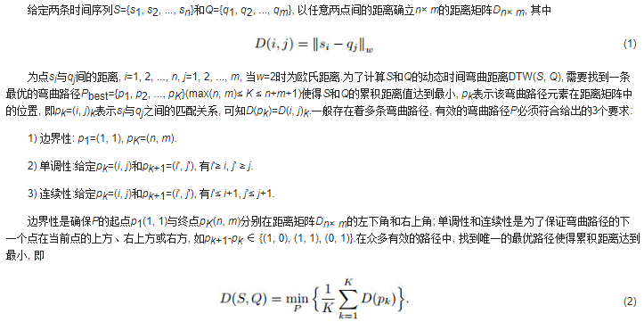
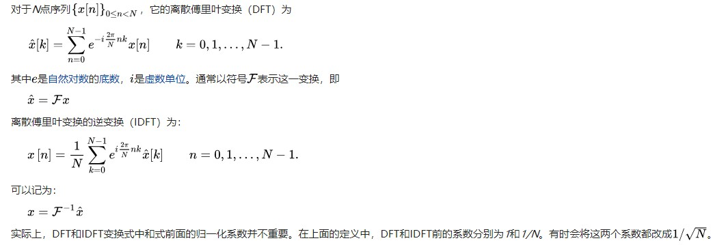

## 概述

- 包括三个步骤：

  - (1)从数据集中采样;
  - (2)在采样的数据集上面进行聚类算法;
  - (3)将数据集中其他的数据根据采样数据集的类别进行分类

- 现在的聚类算法可以大致分为两类：根据**相似性度量**是否是直接用在输入的数据集上的还是用在从数据集中提取的特征上的

  - 第一类： Golay et al 研究了三种时间序列的相似性度量，欧氏距离，两个基于互相关性的距离； Liao et all 采用DTW(Dynamic Time Warping)动态时间扭曲和遗传聚类来对时间序列进行分类
  - 第二类：是基于时间序列是根据内在的模型和概率分布的假设来进行聚类的。比如ARMA(Auto-Aggressive Integrated Moving Average)算法,高斯混合算法，缺点是是模型的学习的计算复杂度很高

- 相似性度量：

  - (1)Lp范数： 其中L1范数对于冲击噪声是鲁棒的；但是对于$p\geq 3$来说会遇到维数灾问题

  - (2)Pearson’s correlation：取值范围是[-1,1],两个变量之间的**皮尔逊相关系数**定义为两个变量之间的协方差和标准差的商：
    $$
    \rho_{X,Y} = \frac{cov(X,Y)}{\sigma_x,\sigma_y}
    $$
    上式是**总体**皮尔逊相关系数，下面是样本皮尔逊相关系数，一般用r表示：
    $$
    r = \frac{\sum^{n}_{i=1}(X_i-\bar X)(Y_i-\bar Y)}{\sqrt{\sum^{n}_{i=1}(X_i-\bar X)^2}\sqrt{\sum^n_{i=1}(Y_i-\bar Y)^2}}=\frac{1}{n-1}\sum^n_{i=1}(\frac{X_i-\bar X}{\sigma_x})(\frac{Y_i-\bar Y}{\sigma_Y})
    $$

  - (3)DTW(动态时间弯曲距离)：

    

- Data Reduction:分为降维或者减少时间序列的数量(size)

  - 离散傅里叶变换(DFT)用于在频域中表示时间序列；离散小波变换用于提供额外的信息；奇异值分解(SVD)和分段聚合近似（PAA）

    

    

  - 采样可以减少时间序列数据集的大小：随机采样/有偏采样

## 算法详解

### Data Reduction

- N个时间序列，$T_{N\times D}:=\{T_1,T_2,...,T_N\}$,每个时间序列是一个D维的序列，现在就是要确定采样序列$T_{s\times d}，s\leq N,d\leq D$

- 提出了关于s选择的上下界的理论证明，可以引导我们选择合适的s：

  假设所有$T_i\in T_{N\times D}$属于k个已知的分类，$n_i$代表第i个分组中时间序列的个数，$p_i = \frac{n_i}{N}$代表第i个分组的占比，$p_i'=\frac{n_i'}{s}$代表采样数据集中第i个分组的占比，则$|p_i-p_i'|$代表了数据集和采样数据集中的占比偏差。现在定义s的上界$s_l$和下界$s_u$。

  对于给定的$\epsilon$和置信水平$1-\alpha$

  (1)对于$p_i< \epsilon$的类来说，对于$s<s_l$不能保证有足够多的instance数量，直观上解释就是下界越低，那么越有可能找到小型的类

  (2)对于$s>s_u$来说，最大的占比偏差应该是在$\epsilon$之内的，直观上，根据大数定律，大于某一个阈值后，样本的分布和总体的分布是一致的

  - **Lemma 1(lower bound)**:m是采样数据及group i中最小的instance数量，给定置信水平$1-\alpha$，那么采样的size $s\geq \frac{m+z_{\alpha}(\frac{z_{\alpha}}{2}+\sqrt{m+\frac{z_{\alpha}^2}{4}})}{p_i}$满足$P(n_i'\geq m)>1-\alpha$,这里$z_{\alpha/2} = P(Z>z_{\alpha/2})=\alpha/2$其中Z是标准正态分布

    注意：m的确定取决于用在采样数据集上的聚类算法

    **证明**：由于是随机采样，那么一个样本属于第i类的概率为$p_i$,由于每个样本都是独立的，那么在所有采样中，采样属于第i个类的样本服从二项分布$n_i'\sim B (s,p_i)$,当s足够大的时候，二项分布$B(s,p_i) \sim N(sp_i,sp_i(1-p_i))$，此时$n_i'$近似服从$N(sp_i,sp_i(1-p_i))$,那么对于事件$\{n_i'\geq m\}\leftrightarrow \{ \frac{n_i'-sp_i}{\sigma}\geq \frac{m-sp_i}{\sigma}\}\leftrightarrow \{Z\geq \frac{m-sp_i}{\sigma}\}$,故而
    $$
    P(n_i'\geq m)>1-\alpha \leftrightarrow P(Z\geq \frac{m-sp_i}{\sigma})>1-\alpha \leftrightarrow \frac{m-sp_i}{\sigma}\leq -z_{\alpha},\\
    where~~~ m\leq sp_i,~~~\sigma = \sqrt{sp_i(1-p_i)}
    $$
    那么根据上面的不等式
    $$
    \begin{equation}
    \begin{aligned}
    \frac{(m-sp_i)^2}{sp_i(1-p_i)} &\geq& z_\alpha^2\\
    m^2+s^2p_i^2-2msp_i&\geq& sp_iz_{\alpha}^2-sp_I^2z_{\alpha}^2\\
    \frac{m^2}{s}+sp_i^2-2mp_i&\geq& p_iz_\alpha^2-p_i^2z_\alpha^2\\
    p_i^2-2p_i\frac{m+z_{\alpha}^2/2}{s+z_\alpha^2}&\geq& -\frac{m^2}{s(s+z_{\alpha}^2)}\\
    (p_i-\frac{m+z_{\alpha}^2/2}{s+z_\alpha^2})^2&\geq&(\frac{m+z_{\alpha}^2/2}{s+z_\alpha^2})^2-\frac{m^2}{s(s+z_\alpha^2)},m\leq sp_i
    \end{aligned}
    \end{equation}
    $$
    由于$z_\alpha$经常落在[0,3]范围内，也就是说$s >>z_\alpha^2\leftrightarrow s+z_{\alpha}^2\approx s   $

    因此，得到$s\geq \frac{m+z_{\alpha}(\frac{z_\alpha}{2}+\sqrt{m+\frac{z_\alpha^2}{4}})}{p_i}$

  - **Lemma 2(upper bound)**:对于给定的$\epsilon\in [0,1]$,置信水平为$1-\alpha$,那么$s\geq \frac{z_{\alpha/2}^2}{4\epsilon^2}$能够满足$P(|p_i-p_i'| < \epsilon) > 1-\alpha, 1\leq i\leq k$

    定理2说明**s仅取决于给定的阈值和置信水平，和输入数据集的大小无关**

    **Proof**:由于$p_i' = \frac{n_i'}{s}\sim N(p_i,\frac{p_i(1-p_i)}{s})\leftrightarrow p_i'-p_i\sim N(p_i,\frac{p_i(1-p_i)}{s})$,故而
    $$
    \{|p_i-p_i'|< \epsilon\}\leftrightarrow \{|Y|<\epsilon\}\leftrightarrow \{|Z|<\frac{\epsilon}{\sigma}\}\\
    where~~\sigma =\sqrt{\frac{p_i(1-p_i)}{s}},\\
    So~~when~~\frac{\epsilon}{\sigma}>z_{\alpha/2}, ~~P(|Z|<\frac{\epsilon}{\sigma})>1-\alpha\\
    s\geq \frac{z_{\alpha/2}^2}{p_i(1-p_i)\epsilon^2}\geq \frac{z_{\alpha/2}^2}{4\epsilon^2}
    $$

### 降维度

- 采用分段聚合近似(PAA)，从$T_i := (t_{i1},t_{i2},...,t_{iD})$转换为$T_i' := (\tau_{i1],...,\tau_{id}})$公式如下
$$
\tau_{ij} = \frac{d}{D}\sum^{\frac{D}{d}j}_{k = \frac{D}{d}(j-1)+1}t_{ik}
$$
一个关键的步骤就是要确定d的大小，根据**香农采样定理**，如果最高频率为B，那么采样频率为2B时可以无损复原，文章中提出了**基于自相关性的方法来大概确定时间序列的频率上界**，首先根据自相关曲线$g_i$的第一个局部最小点确定临界频率，为$g_i(y) = \sum^{D-y}_{j=1}t_{ij}t_{i(j+y)}$,其中y是滞后。如果对于某一个$y'$,$g_i$存在一个极小值，如果$g_i(y')<0$,$y'$与典型半衰期有关，再次情况下，我们把$1/y_i'$叫做$T_i$的临界频率。$y_i'$越小，代表着他的临界频率越大，找到所有的临界频率之后，我们按照降序进行排列，选择一个较高的百分比，如80%，来对所有的时间序列的上界进行估计，不用小的临界频率值的原因是降低额外噪声的影响。

- 自相关曲线可以通过快速傅里叶变换求取

$$
F_g(f) = FFT[T_i]\\
S(f)=F_g(f)F_g^{*}(f)\\
g(y) = IFFT[S(f)]
$$

### 基于密度的聚类

* 采用L1范数作为距离相似性度量（因为对于冲击噪声的鲁棒性和计算简便性）

* 对于数据集的分布没有假设、

* 用PCA来对数据集降维到两个维度的子空间上来观察它的空间分布

* 实际的时间序列有相位的变化，随机的噪声，影响聚类的效果

* 如果两个时间序列相位差别很小，那么他的L1范数也很小，随着数据集size的增大，对于有很大相位差的两个时间序列，基于密度的聚类算法可以保证将两个时间序列聚类

* **给出了关于相位扰动和噪声理论上的边界，找到了数据size n，相位扰动上界**$\Delta$**以及事件：时间序列之间相位差别小于**$\Delta$**的可以被聚类在一起 发生的概率P之间的关系，从而**$\Delta$**可以根据P和n来确定**

  定义时间序列$T(a) = \{f(a+b),...f(a+mb)\}$,a是初始相位，b是时间序列采样的间隔，m是时间序列的长度。假设T(a)是根据f(t)来采样得到的，这里假设f(t)是一个解析函数，另外一个时间序列为$T(a-\delta) = \{f(a+b-\delta),..,f(a+mb-\delta)\}$,假设现在有n个时间序列$T(a-\delta_i)$,其中$\delta_i \in [0,\Delta]$,假设这些时间序列之间是相互独立的，$\delta_i$是在$[0,\Delta]$之间均匀分布的，现在定义基于密度的聚类算法中的距离阈值为$\epsilon$，定义下面事件为
  $$
  E_n := \{T(a-\delta_i),i=1,2,...n. belong~to~same~cluster\}
  $$
  **Lemma 3:**$P(E_n)\geq 1-n(1-\frac{\epsilon}{mMk\Delta})^n$

  **证明**：(1)首先证明$\exist M,s.t., L_1(T(a),T(a-\delta)) := \sum^m_{i=1}|f(a+ib)-f(a+ib-\delta|\leq mM\delta$

  （2)把区间$[0,\Delta]$分为若干个小区间，长度为$\frac{\epsilon}{mMk}$,下面分情况进行讨论， 如果每个小区间对应最少一个时间序列，那么$L_1(T(a),its~KNN)\leq  mM\times \frac{\epsilon}{mMk}\times k =\epsilon$,此时，所有的时间序列都是个hi密度相连的，他们可以被聚类到一起。

  (3)定义事件$U_j = \{j^{th} ~bucket~is~empty\}$，那么
  $$
  P(at~least~one~bucket~is~empty)=P(\cup_j U_j)\leq \sum_jP(U_j)=n(1-\frac{\epsilon}{mMk\Delta})^n
  $$
  因为每个bucket的长度为$\frac{\epsilon}{mMk}$,那么对于$\Delta$区域之内bucket的数量为$\frac{\Delta}{\frac{\epsilon}{mMk}}$，

  **这个地方存疑，我觉得是**$C_n^1(1-\frac{\epsilon}{mMk\Delta})^{n -1}\frac{\epsilon}{mMk\Delta}$.

  注意到事件：没有空的bucket  是事件$E_n$的子集，因此
  $$
  P(E_n) \geq P(no~empty~bucket) = 1-p(\cup_j U_j)\geq 1-n(1-\frac{\epsilon}{mMk\Delta})^n
  $$

* 密度估计：思想是画出$k_{dis}$图来，根据斜率来进行density radius的选择，定义经验分布函数为
  $$
  EDF_k(r):=\frac{|\{objeccts~whose~k_{dis}~\leq r\}|}{N}
  $$
  **Lemma 4**: $EDF_k(r)\approx \sum^N_{m=k+1}P(E_{m,r})$，其中$P(E_{m,r}) = C_{N-1}^{m-1}P_r^{m-1}(1-P_r)^{N-m}, P_r = \frac{V_r}{V}=\frac{c_d\times r^d}{V}$,$V_r$是在d维$L_p$空间上的超球面的体积，例如在欧氏空间上， $c_d = \frac{\pi^{d/2}}{\Gamma(\frac{d}{2}+1)}$,(注意 $\Gamma(n) = (n-1)!$)

  **Lemma 5**：$k_{dis}$图上面Y值的拐点是density radius

  **Proof:** 

