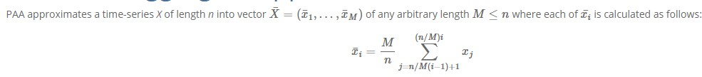

### 概述

- 包括三个步骤：

  - (1)从数据集中采样;
  - (2)在采样的数据集上面进行聚类算法;
  - (3)将数据集中其他的数据根据采样数据集的类别进行分类

- 现在的聚类算法可以大致分为两类：根据**相似性度量**是否是直接用在输入的数据集上的还是用在从数据集中提取的特征上的

  - 第一类： Golay et al 研究了三种时间序列的相似性度量，欧氏距离，两个基于互相关性的距离； Liao et all 采用DTW(Dynamic Time Warping)动态时间扭曲和遗传聚类来对时间序列进行分类
  - 第二类：是基于时间序列是根据内在的模型和概率分布的假设来进行聚类的。比如ARMA(Auto-Aggressive Integrated Moving Average)算法,高斯混合算法，缺点是是模型的学习的计算复杂度很高

- 相似性度量：

  - (1)Lp范数： 其中L1范数对于冲击噪声是鲁棒的；但是对于$p\geq 3$来说会遇到维数灾问题

  - (2)Pearson’s correlation：取值范围是[-1,1],两个变量之间的**皮尔逊相关系数**定义为两个变量之间的协方差和标准差的商：
    $$
    \rho_{X,Y} = \frac{cov(X,Y)}{\sigma_x,\sigma_y}
    $$
    上式是**总体**皮尔逊相关系数，下面是样本皮尔逊相关系数，一般用r表示：
    $$
    r = \frac{\sum^{n}_{i=1}(X_i-\bar X)(Y_i-\bar Y)}{\sqrt{\sum^{n}_{i=1}(X_i-\bar X)^2}\sqrt{\sum^n_{i=1}(Y_i-\bar Y)^2}}=\frac{1}{n-1}\sum^n_{i=1}(\frac{X_i-\bar X}{\sigma_x})(\frac{Y_i-\bar Y}{\sigma_Y})
    $$

  - (3)DTW(动态时间弯曲距离)：

    

- Data Reduction:分为降维或者减少时间序列的数量(size)

  - 离散傅里叶变换(DFT)用于在频域中表示时间序列；离散小波变换用于提供额外的信息；奇异值分解(SVD)和分段聚合近似（PAA）

    

    

  - 采样可以减少时间序列数据集的大小：随机采样/有偏采样

### 算法详解

#### Data Reduction

- N个时间序列，$T_{N\times D}:=\{T_1,T_2,...,T_N\}$,每个时间序列是一个D维的序列，现在就是要确定采样序列$T_{s\times d}，s\leq N,d\leq D$

- 提出了关于s选择的上下界的理论证明，可以引导我们选择合适的s：

  假设所有$T_i\in T_{N\times D}$属于k个已知的分类，$n_i$代表第i个分组中时间序列的个数，$p_i = \frac{n_i}{N}$代表第i个分组的占比，$p_i'=\frac{n_i'}{s}$代表采样数据集中第i个分组的占比，则$|p_i-p_i'|$代表了数据集和采样数据集中的占比偏差。现在定义s的上界$s_l$和下界$s_u$。

  对于给定的$\epsilon$和置信水平$1-\alpha$

  (1)对于$p_i< \epsilon$的类来说，对于$s<s_l$不能保证有足够多的instance数量，直观上解释就是下界越低，那么越有可能找到小型的类

  (2)对于$s>s_u$来说，最大的占比偏差应该是在$\epsilon$之内的，直观上，根据大数定律，大于某一个阈值后，样本的分布和总体的分布是一致的

  - **Lemma 1(lower bound)**:m是采样数据及group i中最小的instance数量，给定置信水平$1-\alpha$，那么采样的size $s\geq \frac{m+z_{\alpha}(\frac{z_{\alpha}}{2}+\sqrt{m+\frac{z_{\alpha}^2}{4}})}{p_i}$满足$P(n_i'\geq m)>1-\alpha$,这里$z_{\alpha/2} = P(Z>z_{\alpha/2})=\alpha/2$其中Z是标准正态分布

    注意：m的确定取决于用在采样数据集上的聚类算法

    **证明**：由于是随机采样，那么一个样本属于第i类的概率为$p_i$,由于每个样本都是独立的，那么在所有采样中，采样属于第i个类的样本服从二项分布$n_i'\sim B (s,p_i)$,