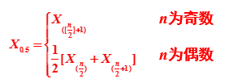
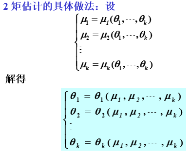
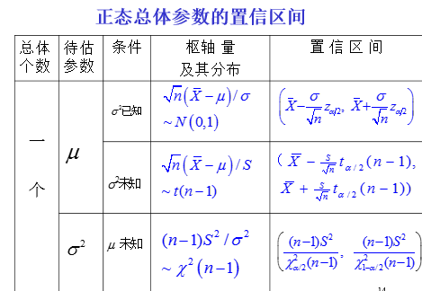
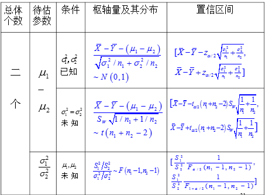
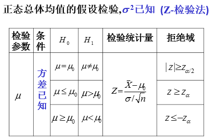
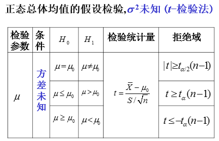
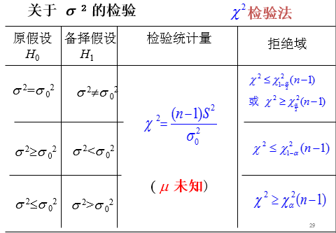

# 总体样本和抽样分布

## 总体样本

- **总体**：研究对象的全体（一般只关心某一个数量指标，如体重等）
- **样本**：总体分布一般未知，从总体中按照一定规则抽取一部分个体，这部分个体叫做这个总体的一个样本
  - **简单随机抽样**： 在相同条件下对总体X进行n次重复，独立观察，得到的样本(X1,X2,...Xn)成为来自总体X的一个简单随机样本（实际上课程中都是**简单随机抽样**）。
  - 设X是具有分布函数F的随机变量，那么对于有同样分布函数的n个随机变量X1,X2,...Xn,称为**样本**，也可以将这n个随机变量（样本）写成一个随机向量(X1,X2,...Xn)。
  - **样本二重性** 抽样前，对于(X1,X2,...Xn)这个n维随机向量，由于是在相同条件下重复独立观察，故而它的联合分布函数与联合概率密度分别为每个随机变量分布函数和概率密度函数的乘积；抽样后，得到(x1,x2,...xn)，称为(X1,X2,...Xn)的观察值，也叫作样本值。

## 抽样分布

- **统计量**：设X1,X2,...Xn为来自总体X 的一个样本，g(X1,X2,...Xn)是X1,X2,...Xn的函数，若 g 中不含任何未知参数，则称g(X1,X2,...Xn)是一统计量.**注意：统计量是*不含未知参数*的样本的函数，本质上是随机变量**
- 常用统计量：
  - 样本均值：   \\( \bar X=\frac{1}{n} \Sigma^{n}\_{i=1}X\_i \\),根据辛钦大数定律，\\(\bar X\\)趋于E(x)
    - 进一步定义样本k阶矩， \\(A\_k=\frac{1}{n}\sum^{n}\_{i=1}X\_i^{k}\\),同样的根据辛钦大数定律，\\(A\_k\\)趋于\\(E(X^k)\\)
  - 样本方差： \\(S^2=\frac{1}{n-1} \sum^{n}\_{i=1}(X\_i-\bar X)^2\\),根据辛钦大数定律，\\(S^2=E(x^2)-E^2(x)\\)
    - 样本标准差： \\(S=\sqrt{S^2}\\)
    - 样本k阶中心矩： \\(B\_k=\frac{1}{n}\sum^{n}\_{i=1}(X\_i-\bar X)^k\\),k=2,3...
  - 中位数： 设有容量为n的样本(X1,X2,...Xn),将其按从小到大分为 \\(X\_{(1)}\leq X\_{(2)}\leq ... \leq X\_{(n)}\\),则中位数定义为

## 抽样分布及其上分位数

- 统计上的三大分布
  - **\\(\chi^2\\)分布**：
    - 定义：设X1,X2,...Xn为来自总体N(0,1)的样本，那么称统计量
      $$\chi^2=X\_1^2+X\_2^2+...+X\_n^2$$
      服从**自由度为n**的\\(\chi^2\\)分布，记为 \\(\chi^2 \sim \chi^2(n)\\),n表示独立随机变量的个数
    - 性质：
      - 可加性：\\(X\_1\sim\chi^2(n\_1)\\),\\(X\_2\sim\chi^2(n\_2)\\),且X1和X2相互独立，则
        $$X\_1+X\_2\sim \chi^2(n\_1+n\_2)$$
      - 设X1,X2,...Xn相互独立，均服从正态分布\\(N(\mu,\sigma^2)\\),则
        $$\chi^2=\frac{1}{\sigma^2}\sum^n\_{i=1}(X\_i-\mu)^2\sim\chi^2(n)$$
      - 若\\(X\sim \chi^2(n)\\)，则 E(X)=n,D(X)=2n
      - **上\\(\alpha\\)-分位点**：给定正数\\(\alpha\\)(0<\\(\alpha\\)<1),称满足条件：
        $$P ( \chi^2>\chi^2\_\alpha(n) )=\int^\infty\_{\chi^2\_\alpha(n)}f(y)dy=\alpha$$
        的点\\(\chi^2\_\alpha(n)\\)称为\\(\chi^2(n)\\)分布的上\\(\alpha\\)-分位点
  - **t分布**：
    - 定义：设\\(X\sim N(0,1),Y\sim \chi^2(n)\\),且X与Y相互独立，则称随机变量
      $$t=\frac{X}{\sqrt{Y/n}}$$
      服从**自由度为n**的t分布，记为 \\(t\sim t(n)\\)
    - 性质：
      - E(t)=0;D(t)=n/(n-2),对n>2
      - t分布密度函数关于t=0对称，且\\(\lim\_{|t|\to\infty} f(t)=0\\),n充分大时，t分布近似于N(0,1)
      - **上\\(\alpha\\)-分位点**:给定正数\\(\alpha\\)(0<\\(\alpha\\)<1),称满足条件：
        $$P ( t>t\_\alpha(n) )=\int^\infty\_{t\_\alpha(n)}f(t)dt=\alpha$$
        的点\\(t\_\alpha(n)\\)称为\\(t(n)\\)分布的上\\(\alpha\\)-分位点
        - 根据对称性有\\(t\_{1-\alpha}(n)=-t\_\alpha(n)\\)
  - **F分布**
    - 定义： 设 \\(U \sim \chi^2(n\_1),V\sim \chi^2(n\_2)\\),U与V相互独立，则称随机变量
      $$F=\frac{U/n\_1}{V/n\_2}$$
      服从**自由度为n1及n2**的F分布，记为\\(F\sim F(n\_1,n\_2)\\).
    - 性质：
      - \\(\frac{1}{F}=\frac{V/n_2}{U/n1}\sim F(n\_2,n\_1)\\)
      - **上\\(\alpha\\)-分位点**:给定正数\\(\alpha\\)(0<\\(\alpha\\)<1),称满足条件：
        $$P ( F>F\_\alpha(n\_1,n\_2) )=\int^\infty\_{F\_\alpha(n\_1,n\_2)}\Psi(y)dy=\alpha$$
        的点\\(F\_\alpha(n\_1,n\_2)\\)称为\\(F(n\_1,n\_2)\\)分布的上\\(\alpha\\)-分位点
        **$$F\_{1-\alpha}(n\_1,n\_2)=\frac{1}{F\_\alpha(n\_2,n\_1)}$$**
- 几个重要的抽样分布定理：ppt6-2 P41
  - 设X1,...Xn为来自总体X的一个样本，且\\(EX=\mu,DX=\sigma^2\\),则
    $$E\bar X=\mu,D\bar X=\frac{\sigma^2}{n},E(S^2)=\sigma^2$$
  - 上述\\(\bar X\\)满足 \\(\bar X\sim N(\mu,\frac{\sigma^2}{n})\\)或者\\(\frac{\bar X-\mu}{\sigma/\sqrt(n)}\sim N(0,1)\\)
  - **(注意此处和第一条的条件不同！！)**设X1,X2,...Xn是来自正态总体\\(N(\mu,\sigma^2)\\)的样本，\\(\bar X\\)和\\(S^2\\)分别为样本均值和方差则
    $$\frac{(n-1)S^2}{\sigma^2}\sim \chi^2(n-1)$$
    $$\bar X和S^2相互独立$$
    $$\frac{\bar X-\mu}{S/\sqrt{n}}\sim t(n-1)$$
  - 两正态总体样本均值差的分布 ：设\\(X\sim N(\mu\_1,\sigma^2),Y\sim N(\mu\_2,\sigma^2)\\),**（注意方差相同）**，X与Y独立，设X1,X2,...Xn为来自总体X的样本，Y1,Y2,...Yn为来自总体Y的样本，则有
    $$\frac{\bar X-\bar Y-(\mu\_1-\mu\_2)}{S\_w\sqrt{\frac{1}{n\_1}+\frac{1}{n\_2}}}\sim t(n\_1+n\_2-2)$$
    其中
    $$S\_w^2=\frac{(n\_1-1)S\_1^2+(n\_2-1)S\_2^2}{n\_1+n\_2-2}$$
  - 两正态总体样本方差比的分布设\\(X\sim N(\mu\_1,\sigma\_1^2),Y\sim N(\mu\_2,\sigma\_2^2)\\),**（注意方差不同）**，X与Y独立，设X1,X2,...Xn为来自总体X的样本，Y1,Y2,...Yn为来自总体Y的样本，则有
    $$\frac{S\_1^2/S\_2^2}{\sigma\_1^2/\sigma\_2^2}\sim F(n\_1-1,n\_2-1)$$

# 参数估计（点估计+区间估计）

## 点估计--估计未知参数的值

### 矩估计法

- 整体思想：用样本的K阶原点矩作为总体k阶原点矩的一个估计，即用\\(A\_k=\frac{1}{n}\sum^n\_{i=1}X\_i^k\\)估计\\(\mu\_k\\),进而估计未知参数\\(\theta\\)
- ，例题见PPT7-1，P16，P18

### 最大似然估计法

- 整体思想： 根据样本观测值，选择参数p的估计\\(\hat p\\),使得样本在该样本值附近出现的可能性最大。
- **最大似然估计法**:
  - **若X为离散型随机变量**，设X1,X2,...Xn为来自X的样本，则X1,X2,...Xn的联合分布律为 \\(\prod^n\_{i=1}p(x\_i;\theta)\\),又设x1,x2,...xn为X1,X2,...Xn的样本值，易知事件{X1=x1,X2=x2,...Xn=xn}发生的概率为：
    $$L(\theta)=L(x\_1,...,x\_n,\theta)=\prod^n\_{i=1}p(x\_i,\theta)$$
    它是关于\\(\theta\\)的函数，\\(L(\theta)\\)称为样本的似然函数
    固定样本观测值x1,x2,...xn,挑选使得似然函数L最大的参数\\(\hat\theta\\),\\(\hat\theta\\)与x1,x2,...xn有关，称之为\\(\theta\\)的**最大似然估计值**，称\\(\hat \theta(X\_1,...X\_n)\\)为参数\\(\theta\\)的**最大似然估计量**。
  - **若X为连续性随机变量**，设其概率密度为\\(f(x;\theta)\\),\\(\theta\\)为待估参数，设X1,X2,...Xn为来自X的样本，则X1,X2,...Xn的联合密度为：
    $$\prod^n\_{i=1}f(x\_i;\theta)$$
    设x1,x2,...xn为X1,X2,...Xn的一个样本值，则随机点(X1,X2,...Xn)落在(x1,x2,...xn)的邻域(边长为dx1,dx2,...dxn的n维立方体)内的概率近似为:
    $$\prod^{n}\_{i=1}f(x\_i;\theta)dx\_i$$
    取\\(\theta\\)的估计值\\(\hat\theta\\),使得上式概率取到最大值。
    但由于\\(\prod^n_{i=1}dx\_i\\)不随\\(\theta\\)变化，故只需要考虑
    $$L(\theta)=L(x1,...xn;\theta)=\prod^{n}\_{i=1}f(x\_i;\theta)$$
    的最大值，上式为样本的似然函数，挑选使得L最大的参数\\(\hat\theta\\)，称之为\\(\theta\\)的**最大似然估计值**，称\\(\hat\theta(X1,X2,...Xn)\\)为\\(\theta\\)的**最大似然估计量**。
- 最大似然估计法步骤：
  - 先得到总体的分布律(概率密度)
  - 写出样本的联合分布律（联合密度）
  - 而后将\\(\theta\\)看做自变量，其他看作已知量，构造似然函数\\(L(\theta)\\)**此处应注意L是否是连续的，若连续进行下一步，不连续需要根据定义求，见PPT7-1 P50**
  - 求似然函数L的最大值点，即求出L关于\\(\theta\\)的导数，或者先对L求对数，再关于\\(\theta\\)求导数，让导数为0；
- 最大似然估计的性质
  - 不变性：设\\(\theta\\)的函数\\(u=u(\theta)\\)具有单值反函数\\(\theta=\theta(u)\\).假设\\(\hat\theta\\)是X的概率分布中参数\\(\theta\\)的最大似然估计，则\\(\hat u=u(\hat\theta)\\)是\\(u(\theta)\\)的最大似然估计。

## 估计量的评选标准

- **无偏性**：若估计量\\(\hat\theta=\hat\theta(X1,X2,...Xn)\\)的数学期望\\(E(\hat\theta)\\)存在，且对任意\\(\theta\\)有
  $$E(\hat\theta)=\theta$$
  则称\\(\hat\theta\\)为\\(\theta\\)的无偏估计量。
  - 样本均值\\(\bar X\\)和样本方差\\(S^2\\)分别是总体均值\\(\mu\\)和总体方差\\(\sigma^2\\)的无偏估计。
  - \\(A\_k=\frac{1}{n}\sum^n\_{i=1}X\_i^k\\)是总体k阶矩\\(\mu\_k\\)的无偏估计量。
  - \\(X\sim N(\mu,\sigma^2)\\)，其中\\(\mu,\sigma^2\\)未知，用最大似然估计法得到\\(\mu,\sigma^2\\)的估计量，会发现\\(\hat\mu\\)是无偏估计，但\\(\sigma^2\\)不是无偏估计。**（PPT7-2 P11）**
- **有效性**：若\\(\hat\theta\_1=\hat\theta\_1(X1,X2,...Xn)\\)和\\(\hat\theta\_2=\hat\theta\_2(X1,...Xn)\\)均为参数\\(\theta\\)的无偏估计，若对于任意\\(\theta\\)，有
  $$D(\hat\theta\_1\leq\hat\theta_2)$$
  且至少对于某一个\\(\theta\\)上式中的不等号成立，则称\\(\hat\theta\_1\\)较\\(\hat\theta\_2\\)有效。
- **相合性**： 设\\(\hat\theta(X1,X2,...Xn)\\)为参数\\(\theta\\)的估计量，若对于任意\\(\theta\\),当n区域无穷时，\\(\hat\theta(X1,X2,...Xn)\\)依概率收敛于\\(\theta\\),则称\\(\hat\theta\\)为参数\\(\theta\\)的相合估计量，即 
  $$\lim\_{n\to\infty}P(|\hat\theta-\theta|<\epsilon)=1$$

## 区间估计--根据样本构造适当区间，使其以一定概率包含未知参数或未知参数的已知函数的真值

- **置信区间**：设总体X的分布函数\\(F(x,\theta)\\)含有一个未知参数\\(\theta\\),对于给定值\\(\alpha\\)\\(0<\alpha<1\\),若从抽自X的样本X1,X2,...Xn确定两个统计量
  $$\underline\theta=\underline\theta(X1,...Xn),\bar\theta=\bar\theta(X1,...Xn),(\underline\theta<\bar\theta)$$
  对于任意\\(\theta\\)满足
  $$P(\underline\theta(X1,...,Xn)<\theta<\bar\theta(X1,...,Xn))\geq 1-\alpha$$
  \\(\underline\theta 和\bar\theta\\)分别称为**置信水平\\(1-\alpha\\)**的双侧置信区间的**置信下限**和**置信上限**
  - X是连续型随机变量，对于给定\\(\alpha\\)，按照要求 \\(P(\underline\theta<\theta<\bar\theta)=1-\alpha\\),求出置信区间
  - X是离散型随机变量时，对于给定的\\(\alpha\\),常找不到区间使得\\(p(\underline\theta<\theta<\bar\theta)=1-\alpha\\),此时应找到区间使得在这区间内的概率最小为\\(1-\alpha\\),并尽可能接近\\(1-\alpha\\)
- **构造置信区间的方法**
  - 枢轴量法：**不用管定义，直接看题PPT7-3 P14**

## 正态总体均值与方差的区间估计

- 单个总体\\(N(\mu,\sigma^2)\\)的情形

  - 背景：X1,X2,...Xn为总体\\(N(\mu,\sigma^2)\\)的样本，\\(\bar X和S^2\\)分别为样本均值和方差，给定的置信水平为\\(1-\alpha\\)
  - **均值\\(\mu\\)的置信区间**
    - \\(\sigma^2\\)已知，均值\\(\mu\\)的置信水平为\\(1-\alpha\\)的置信区间为
      $$(\bar X\pm \frac{\sigma}{\sqrt{n}}z\_{\frac{\alpha}{2}})$$
    - \\(\sigma^2\\)未知，均值\\(\mu\\)的置信水平\\(1-\alpha\\)的置信区间，由于
      $$t=\frac{\bar X-\mu}{S/\sqrt{n}}\sim t(n-1)$$
      因此对于给定的置信水平\\(1-\alpha\\)，确定分位数\\(t\_{\frac{\alpha}{2}}(n-1)\\),使得
      $$P(|\frac{\bar X-\mu}{S/\sqrt{n}}|<t\_{\frac{\alpha}{2}}(n-1))=1-\alpha$$
      从中解得为
      $$(\bar X\pm \frac{S}{\sqrt{n}}t\_{\frac{\alpha}{2}}(n-1))$$
  - **方差 \\(\sigma^2\\)的置信区间**(只考虑\\(\mu\\)未知的情形)
  - 由于\\(\frac{(n-1)S^2}{\sigma^2}\sim \chi^2(n-1)\\),故而对于置信水平\\(1-\alpha\\)，确定分位数\\(\chi^2\_{1-\frac{\alpha}{2}}(n-1),\chi^2\_{\frac{\alpha}{2}}(n-1)\\),使得
    $$ P(\chi^2\_{1-\frac{\alpha}{2}}(n-1)\leq \frac{(n-1)S^2}{\sigma^2} \leq \chi^2\_{\frac{\alpha}{2}}(n-1))=1-\alpha$$
    从中解得置信水平为\\(1-\alpha\\)的置信区间为
    $$(\frac{\sqrt{n-1}S}{\sqrt{\chi^2\_{\frac{\alpha}{2}}(n-1)}},\frac{\sqrt{n-1}S}{\sqrt{\chi^2\_{1-\frac{\alpha}{2}}(n-1)}})$$
  - 总结：

- 两个正态总体\\(N(\mu\_1,\sigma\_1^2),N(\mu\_2,\sigma^2\_2)\\)的情形

  - 背景：定的置信水平为\\(1-\alpha\\)，X1,X2,...Xn为第一个总体的样本，Y1,Y2,...,Yn为第二个总体的样本，已知\\(\bar X和\bar Y\\)为总体的样本均值，\\(S^2\_1和S^2\_2\\)为两总体的样本方差

  - **两个总体均值差\\(\mu\_1-\mu\_2\\)的置信区间**

    - \\(\sigma\_1^2,\sigma\_2^2\\)已知，为\\((\bar X-\bar Y\pm z\_{\frac{\alpha}{2}}\sqrt{\frac{\sigma\_1^2}{n\_1}+\frac{\sigma\_2^2}{n\_2}})\\)
    - \\(\sigma\_1^2=\sigma\_2^2=\sigma^2\\),但是\\(\sigma^2\\)未知，则结果为
      $$(\bar X-\bar Y\pm t\_{\frac{\alpha}{2}}(n\_1+n\_2-2)S\_w\sqrt{\frac{1}{n\_1}+\frac{1}{n\_2}})$$

  - **两个总体方差比\\(\sigma^2\_1/\sigma^2\_2\\)的置信区间**(只考虑均值未知情形)

  - 选取\\(\frac{S\_1^2/S\_2^2}{\sigma\_1^2/\sigma\_2^2}\\)作为枢轴量，结果为
    $$(\frac{S^2\_1}{S^2\_2}\frac{1}{F\_{\frac{\alpha}{2}}(n\_1-1,n\_2-1)}<\frac{\sigma^2\_1}{\sigma^2\_2}<\frac{S^2\_1}{S^2\_2}\frac{1}{F\_{1-\frac{\alpha}{2}}(n\_1-1,n\_2-1)})$$

  - 总结：

# 假设检验

## 定义

- 根据样本信息检验关于总体的假设是否正确

## 分类

- 参数假设检验(总体分布已知，检验关于未知参数的某个假设)；
- 非参数假设检验(总体分布未知时的假设检验问题)。

## **假设检验的基本思想和步骤**：

- (1)根据实际问题要求，提出原假设(\\(H\_0\\))和备择假设(\\(H\_1\\))
  - 原假设：需要检验的假设
  - 备择假设：与原假设对立面的全体或者一部分
- (2)构造检验统计量——即判断\\(H\_0\\)是否为真
  - 做法：**先假定\\(H\_0\\)成立**，然后用**样本去判断其真伪。**、
  - 由于样本所含信息很分散，需要**构造统计量\\(T(X\_1,X\_2,...X\_n)**来做判断，称之为**检验统计量**
- (3)给定显著性水平\\(\alpha\\)(\\(0<\alpha<1\\))及样本容量n
  - **注意：由于作出决策的依据是一个样本，但实际上\\(H\_0\\)为真的时候依然可能做出拒绝\\(H\_0\\)的决策，犯这种错误的概率要控制在一个较小的数\\(\alpha\\)，使得**
    $$P(当H\_0为真时拒绝H\_0)\leq \alpha$$
- (4)检验的拒绝域
  - 按照\\(P(当H\_0为真拒绝H\_0)=\alpha\\)，求出拒绝域,注意：其中\\(\alpha\\)称为显著性水平，犯第一类错误的最大概率
- (5)将具体观察值x1,x2,...xn代入，之后做出决策，是接受原假设还是拒绝原假设
  - **注意：在给定\\(\alpha\\)的前提下，接受还是拒绝原假设完全取决于样本值，因此所做检验可能导致以下两类错误**
    - 第一类错误        弃真错误
    - 第二类错误        取伪错误

<table align="center">
<tbody>
<tr>
  <td> </td>
  <td colspan="2">实际情况</td>
</tr>
<tr>
  <td>决定</td>
  <td>H0为真</td>
  <td>H0不为真</td>
</tr>
<tr>
  <td>拒绝H0</td>
  <td>第一类错误</td>
  <td>正确</td>
</tr>
<tr>
  <td>接受H0</td>
  <td>正确</td>
  <td>第二类错误</td>
</tr>
</tbody>
</table>

## 假设检验的指导思想：

- (1)控制犯第一类错误的概率不超过\\(\alpha\\),然后，若有必要，通过
- (2)增大样本容量的方法来减少犯第二类错误的概率
- 只对第一类错误的概率加以控制，而不考虑犯第二类错误的概率的检验，称为**显著性检验**——控制第一类错误的原则
- 注意
  - 备择假设可以是**双侧**，也可以是**单侧**，假设检验分为**双边(备择)假设检验**，**单边(备择)假设检验**
  - 通常把**有把握的、有经验的结论**作为原假设，或者尽可能使**后果严重的错误**成为第一类错误

## 正态总体均值的假设检验

### **单个总体\\(N(\mu,\sigma^2)\\)均值\\(\mu\\)的检验**

- 背景：设总体\\(X\sim N(样本\mu,\sigma^2),X\_1,X\_2,...X\_n\\)为来自总体X的样本
- **\\(\sigma^2=\sigma^2\_0\\)已知**，关于均值\\(\mu\\)的检验(Z检验)：
  - (1)\\(H\_0:\mu=\mu\_0,H\_1:\mu \neq\mu\_0\\)
  - (2)构造检验统计量
    $$Z=\frac{\bar X-\mu\_0}{\sigma\_0/\sqrt{n}}\sim N(0,1)$$
    给定显著性水平\\(\alpha\\)
  - (3)按照控制第一类错误的原则，有
    $$P(|\bar X-\mu\_0|>C)=P(|\frac{\bar X-\mu\_0}{\sigma\_0/\sqrt{n}}|>k)=\alpha$$
    由此，
    $$k=z\_{\frac{\alpha}{2}}\Longrightarrow C=\frac{\sigma_0}{\sqrt{n}}z\_{\frac{\alpha}{2}}$$
  - (4)拒绝域为
    $$W=(x\_1,...,x\_n):\frac{|\bar X-\mu\_0|}{\sigma\_0/\sqrt{n}}>z\_{\frac{\alpha}{2}}$$
    查表\\(z\_{\frac{\alpha}{2}}\\),计算\\(\frac{|\bar X-\mu\_0|}{\sigma\_0/\sqrt{n}}\\),若其大于\\(z\_{\frac{\alpha}{2}}\\)，拒绝原假设，否则，接受原假设。
- 单边检验，例如关于均值的假设检验，\\(\sigma^2\\)已知
  - (1)\\(H\_0:\mu\leq\mu\_0,H\_1:\mu \geq\mu\_0\\)
  - (2)当\\(\mu\leq\mu\_0\\)成立时，
    $$\{\frac{\bar X-\mu\_0}{\sigma/\sqrt{n}}>k\}\subset \{\frac{\bar X-\mu}{\sigma/\sqrt{n}}>k\}$$
    $$P(\frac{\bar X-\mu\_0}{\sigma/\sqrt{n}}>k)\leq P(\frac{\bar X-\mu}{\sigma/\sqrt{n}}>k)$$
    且
    $$\frac{\bar X-\mu}{\sigma/\sqrt{n}}\sim N(0,1)$$
  - (3)构造检验统计量
    $$Z=\frac{\bar X-\mu\_0}{\sigma/\sqrt{n}}\sim N(0,1)$$
    给定显著性水平\\(\alpha\\)
  - (4)按照控制第一类错误的原则，有
    $$P(|\frac{\bar X-\mu\_0}{\sigma/\sqrt{n}}|>k)\leq P(|\frac{\bar X-\mu}{\sigma/\sqrt{n}}|>k)=\alpha$$
    由此，只要取\\(k=z\_{\alpha}\\),可得
    $$P(|\frac{\bar X-\mu\_0}{\sigma/\sqrt{n}}|>z\_{\alpha})\leq \alpha$$
  - (5)拒绝域为
    $$W=(x\_1,...,x\_n):\frac{|\bar X-\mu\_0|}{\sigma/\sqrt{n}}>z\_{\alpha}$$
    查表\\(z\_{\alpha}\\),计算\\(\frac{|\bar X-\mu\_0|}{\sigma/\sqrt{n}}\\),若其大于\\(z\_{\alpha}\\),拒绝原假设，构造，接受原假设。
- 总结：
- **\\(\sigma^2=\sigma^2\_0\\)未知**，关于均值\\(\mu\\)的检验(t检验)PPT8-2P15-22：
- 

## 正态总体方差的假设检验

- 背景：设总体\\(X\sim N(\mu,\sigma^2),\mu,\sigma^2\\)均未知，X1,X2,...Xn为来自总体X是样本
- 

