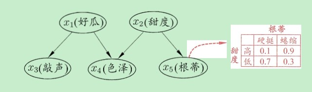
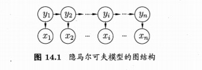

## 贝叶斯网络

### 基本概念

* 贝叶斯网又称为**信念网(belief network)**，借助DAG来描述属性之间的依赖关系

* 一个贝叶斯网B由结构G和参数$\Theta$构成，即$B=<G,\Theta>$

  * 贝叶斯网的结构有效表达了属性之间的条件独立性，若给定父节点集，贝叶斯网假设每个属性与它的非后裔属性独立，于是$B=<G,\Theta>$将属性$x_1,x_2,...,x_d$的联合概率分布定义为
    $$
    P_B(x_1,x_2,...,x_d)=\Pi^d_{i=1}P_B(x_i|\pi_i)=\Pi^d_{i=1}\theta_{x_i|\pi_i}
    $$
    

    例如对于上图，联合概率分布为
    $$
    P_B(x_1,x_2,x_3,x_4,x_5)=P(x_1)P(x_2)P(x_3|x_1)P(x_4|x_1,x_2,)P(x_5|x_2)
    $$
    

    对于同父结构，给定$x_1$的取值，$x_3$和$x_4$条件独立；在V型结构，给定$x_4$的值，那么$x_1$和$x_2$必不独立，但是若$x_4$未知，则$x_1,x_2$是相互独立的；在顺序结构中，给定x的值，则y与z条件独立；

    **边际独立性(marginal independence)**: 
    $$
    P(x_1,x_2)=\sum_{x_4}P(x_1,x_2,x_4)=\sum_{x_4}P(x_4|x_1,x_2)P(x_1)P(x_2)=P(x_1)P(x_2)
    $$

## 概率图模型

### 隐马尔可夫模型

* 假定所关心的变量集合为Y，可观测的变量集合为O，其他变量的集合为R，“生成式”模型考虑联合分布$P(Y,R,O)$，“判别式”模型考虑调剂那份不$P(Y,R|O)$.给定一组观测变量值，推断就是要由$P(Y,R,O)$或者$P(Y,R|O)$得到条件概率分布$P(Y|O)$

* **概率图模型**是一类用图来表达变量相关关系的概率模型。大致可以分为两类：

  * 使用DAG表示变量之间的依赖关系，称为有向图模型或贝叶斯网

  * 使用无向图表示变量之间的相互关系，称为无向图模型或者马尔可夫网

  * **隐马尔可夫模型**(HMM)是结构最简单的动态贝叶斯网，变量可以分为两组，第一组是状态/隐变量，第二组是观测变量

    

    所有变量的联合概率分布为
    $$
    P(x_1,y_1,...,x_n,y_n)=P(y_1)P(x_1|y_1)\Pi^n_{i=2}P(y_i|y_{i-1})P(x_i|y_i)
    $$
    **参数**确定：

    状态转移概率： $A=[a_{ij}]_{N\times N}$,其中 $a_{ij}=P(y_{t+1}=s_j|y_t=s_i)$,$i,j\in[1,N]$

    输出观测概率：$B=[b_{ij}]_{N\times M}$,其中$b_{ij} = P(x_t=o_j|y_t=s_i)$,$i\in [1,N],j\in [1,M]$

    初始状态概率：$\pi=(\pi_1,\pi_2,...\pi_N)$,其中$\pi_i=P(y_1=s_i),i\in[1,N]$

### 马尔可夫随机场

* 马尔可夫随机场是典型的马尔可夫网，这是一种著名的无向图模型。图中每一个节点代表一个或者一组变量，边表示节点之间的依赖关系，马尔可夫随机场中有一组**势函数**，主要用于定义概率分布函数

* 若图中的任意两节点都有边相连接，则称该节点集为**团**，若在一个团中加入任何另外一个节点都不能构成团，那么此团称为**极大团**，在马尔可夫随机场中，多变量之间的联合概率分布能基于团分解为多个因子的乘积，每个因子仅与一个团相关，对于n和变量$x=\{x_1,x_2,...,x_n\}$,所有团构成的集合C，以及团$Q\in C$对应的变量集合为$x_{Q}$,联合概率定义为
  $$
  P(x)=\frac{1}{Z}\Pi_{Q\in C}\psi_Q(x_Q)
  $$
  其中$\psi_Q$为与团Q对应的是函数，$Z=\sum_x\Pi_{Q\in C}\psi_Q(x_Q)$为规范化因子

  但是，若变量的个数较多，那么团的数目也会很多，计算复杂，注意到若Q不是极大团，则它一定被一个极大团$Q^*$包围，那么可以重新定义联合概率P,界定所有极大团集合为$C^*$
  $$
  P(x)=\frac{1}{Z^*}\Pi_{Q\in C^*}\psi_Q(x_Q)
  $$
  其中$Z^* =\sum_x\Pi_{Q\in C^*}\psi_Q(x_Q)$为规范化因子

* 若从节点集A中的节点到B中节点都必须经过C中的节点，那么C称为**分离集**，对于马尔可夫随机场，有**全局马尔可夫性**:给定两个变量子集的分离集，则这两个变量子集条件独立。也即是$x_A和x_B$在给定$x_C$的条件下独立