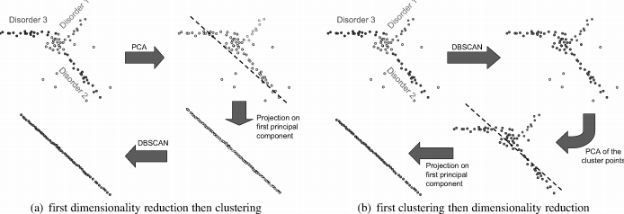

# 高维度数据的聚类

高维度数据的聚类算法就是想在原来特征空间的任意方向的子空间上找到聚类

- 实际上降维度在高维空间很多时候并不合适

  

  只考虑平行于坐标轴上的子空间的数量也是**指数级**的，为$2^d-1$种

## 分类

### 基本分类：

- 投影聚类法和子空间聚类法是想找到平行于axis的子空间来进行聚类
- correlation clustering algorithm:是针对于类别是在任意方向上的子空间的
- pattern-based聚类算法：有些是限制在平行于axis上，有些是对于任意方向上的子空间的特殊情况，比较杂

### 基于问题的分类

- Projected clustering algorithms:
  - 为每一个点找到一个准确的子空间聚类
- "Soft" Projected clustering algorithm
  - 不同的属性有不同的权重，所有属性构成了一个类，通常一个子空间不会“强硬”地分配给一个类
- Subspace clustering algorithm
  - 找到可以明确类别的所有子空间
- Hybrid Algorithm
  - 找到可能交叠的类，不要求找到子空间上的所有聚类，

### 基于算法的分类：

- 自上而下的方法
  - 通过确定给定点集的属性子集，确定从全维空间开始的集群的子空间，使得当投影到相应的子空间时，这些点满足给定的集群标准
  - **局限性**：为了确定一个类对应的子空间，必须知道一些聚类的成员；为了确定聚类的成员，每个类对应的子空间必须知道，这是一个**循环的依赖关系**
  - 方法：有一个**条件很高的假设**，一个类对应的子空间可以通过这个类或者类成员的邻域来确定
- 从底向上的方法：
  - 类似于找频繁项集的方法，如Apriori算法
  - **注意**:有些从底向上的算法不用Spriori算法来进行搜索，而是用一些启发式的算法

## 现有算法的介绍和分类

### Projeceted Clustering Algorithm

- **PROCLUS**[Aggarwal et al. 1999]:分为三个阶段：初始化阶段，迭代阶段，类别改进阶段[参考博客](https://yantijin.github.io/2018/11/28/A-Fast-Algorithm-for-Projected-Clustering/)
- **FINDIT**[Woo et al. 2004]:采用了额外的启发式策略来提高效率和聚类的准确性
- **SSPC**[Yip et al. 2005]: 通过以标记对象和/或标记属性的形式使用领域知识，提供进一步提高准确性的能力。
- **DBSCAN**[Ester et al. 1996]: 基于密度的聚类方法
- **PreDeCon**[Bohm et al. 2004]: 基于DBSCAN算法提出了一种特出的距离方法来获取每个类别的子空间，称为**subspace preference**,计算子空间偏好度(subspace preference),表示p点聚类最好时能够达到的最大维度的子空间,其中一个维度称为与子空间偏好度相关,若这些点在p点很近的区域内的方差在一个阈值之下.计算距离则是带有权重欧氏距离,和子空间偏好度有关的维度的权重远大于1，其他的维度的权重为1。**缺点**是一些输入的参数很难猜
- **CLTree**[Liu et al. 2000]: 基本思想是把现有的所有点标记为一类，然后加入在数据空间均匀分布的一些点作为一个不同的类，然后训练决策树来区分，**缺点**： 根据信息增益确定属性分类计算量太大，叠加的人工数据对于结果有很大影响

### “Soft”-Projected Clustering Algorithm

目前都采用一个权重的框架（所有属性的权重都大于0），这些研究主要和数据分析以及机器学习系那个管，目的是为了在聚类的过程中能够保持对一个目标函数的优化的可能性

- **LAC(Locally Adaptive Clustering)**[Domeniconi et al. 2004]：初始化k个中心以及k个d维权重向量(假设有d个属性)，通过调整权重来尽量达到k个高斯分布
- **Weighted k-means**[Cheng et al. 2008]: 与LAC很像，但是他允许纳入进一步的约束
- **COSA**[Friedman and Meulman 2004]:推导出一个可以用于任何聚类算法的相似度矩阵(woc这个思路牛批!),每个属性的权重为

$$
\frac{the~distance ~of ~point ~p ~to~ all~ k-nearest neighbor~of~ p~ in~ that~ attribute}{the~ distance~ of ~point~ p~ to~ all~ k-nearest~ neighbor~ of~ p~ in~ all ~attribbutes}
$$

### Subspace Clustering Algorithms:

- **CLIQUE**:利用了基于网格的聚类方法，数据空间由轴平行网格划分为宽度为$\epsilon$的等分单位。只有一个网格中含有不少于$\tau$个点才会被认为是一个dense unit，那么一个cluster被定义为临近dense unit的最大集合，可以采用类似Apriori的思想，先看k维上的dense units，然后根据k维上的dense units确定(k+1)维上的dense units
- **ENCLUS**[Cheng et al. 1999]: 也是利用grid，但是是为了找可能存在一个或者多个clusters 的子空间
- **MAFIA**[Nagesh et al. 2001]: 与CLIQUE很相似，但是是采用了一个自适应调整的网格
- **nCluster**[Liu et al. 2007]：CLIQUE的变体，允许长度为δ的重叠窗口作为网格的一维单元。
- **SUBCLU**[Kailing et al. 2004]：对于DBSCAN算法来说，密度相连集合满足向下闭合特性。所以可以在子空间中按照Apriori算法的思路来进行聚类,**注意**：一个density threshold（不管是SUBCLU还是基于网格的），一个tighter的阈值在低维度上区分度很好，但是在高位上可能会损失cluster，而较为宽松的阈值可以发现高维度的cluster，但是在低维度的聚类上产生额外的数量的类

### 混合聚类算法(Hybrid Clustering Algorithms):

- **DOC** [Procopiuc et al. 2002]: 使用全局密度阈值通过包含至少α个点的固定边长w的超立方体来定义子空间簇。